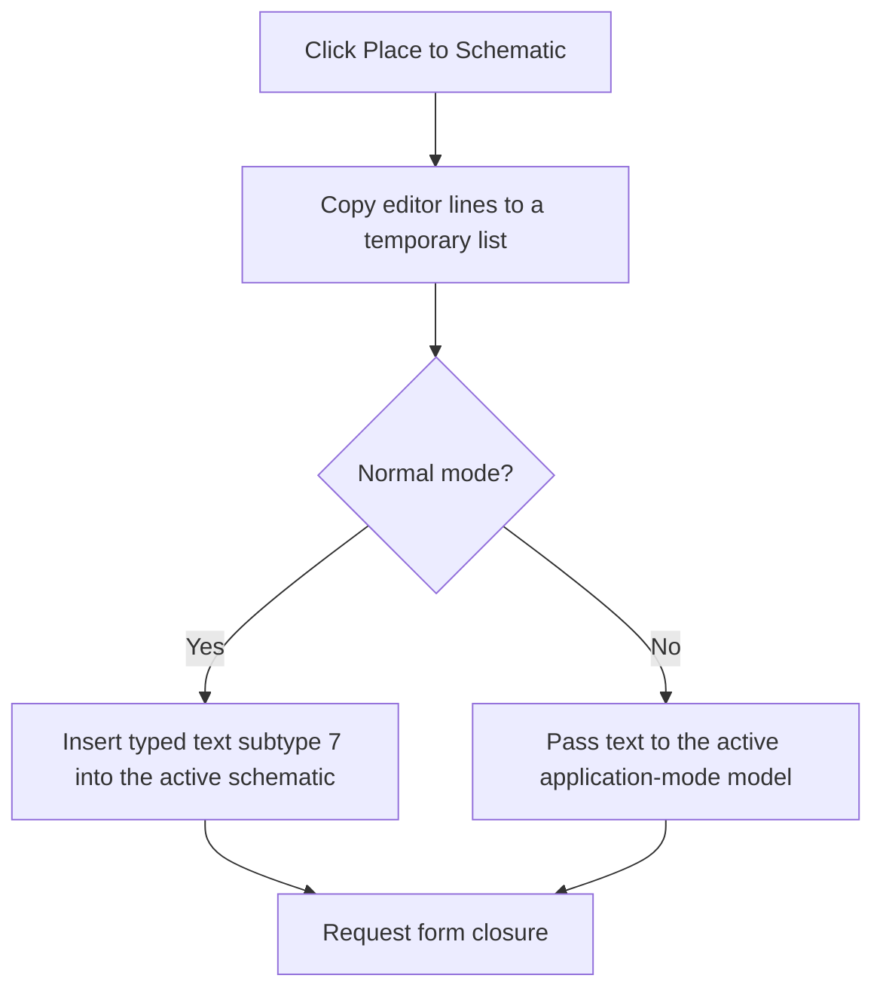

# Place to Schematic

> Analysis status: Recovered editor-text copy, mode branch, schematic insertion, and form-close path reviewed.

## Control

| Property | Recovered value |
| --- | --- |
| Form | PyMainForm |
| Component path | PyMainForm.Panel1.Panel2.sbPlace |
| Control class | TSpeedButton |
| Caption | Not present in the recovered resource. |
| Hint | Place to Schematic |
| Text | Not present in the recovered resource. |
| Handler name | sbPlaceClick |
| Handler address | 0146f670 |
| Graph node | `resource:dfm:PyMainForm/PyMainForm.Panel1.Panel2.sbPlace` |
| Handler node | `function:0146f670` |
| Graph layer | UI |

## What happens when clicked

The handler creates a temporary string list and copies all main-editor lines into it. In normal mode, it converts the editor text to one string and calls the schematic insertion routine with subtype 7. That routine creates a typed schematic text object, copies the text and font, adds it to the active schematic, marks the schematic changed, positions the object at the current pointer, and refreshes related editor state.

In an application mode, the handler instead initializes the active schematic context once and passes the editor lines and text into two recovered model interfaces. The exact application-mode object is not named. Both paths then close the Python Shell form through the VCL close pipeline. The handler has no empty-text check, rollback, or local catch.

## Click flow

## Handler evidence

- Source: [DecompiledSources/Tina16/functions/000000000146F670__FUN_0146f670.c](../../../DecompiledSources/Tina16/functions/000000000146F670__FUN_0146f670.c)
- Recovered role: Not present in the recovered resource.
- Current graph summary: Handles 1 Delphi UI event: PyMainForm.Panel1.Panel2.sbPlace.OnClick.
- Current graph behavior: Not present in the recovered resource.
- Current graph evidence: Not present in the recovered resource.
- Complexity: complex
- Distinct outgoing calls: 6

## Direct calls

- `function:00410f20` — Nil-safe Delphi object destruction helper
- `function:004b6930` — FUN_004b6930
- `function:00805200` — FUN_00805200
- `function:00bf2c10` — FUN_00bf2c10
- `function:0199e310` — FUN_0199e310
- `function:01c9c910` — FUN_01c9c910

## Resource evidence

- Kind: Not present in the recovered resource.
- Modal result: Not present in the recovered resource.
- Checked state: Not present in the recovered resource.
- List items: Not present in the recovered resource.
- Image reference: Not present in the recovered resource.
- Extracted glyph: [`0314_PyMainForm_PyMainForm_Panel1_Panel2_sbPlace_Glyph_Data.png`](../../../glyph/0314_PyMainForm_PyMainForm_Panel1_Panel2_sbPlace_Glyph_Data.png)

## Nearby label candidates

Nearby labels are layout candidates only. They are not proof of behavior.

- No same-parent label candidate is available.

## Analysis limits

- Do not infer behavior from the control class, caption, hint, glyph, or nearby label alone.
- The exact purpose and original names of the two application-mode interfaces are not recovered.
