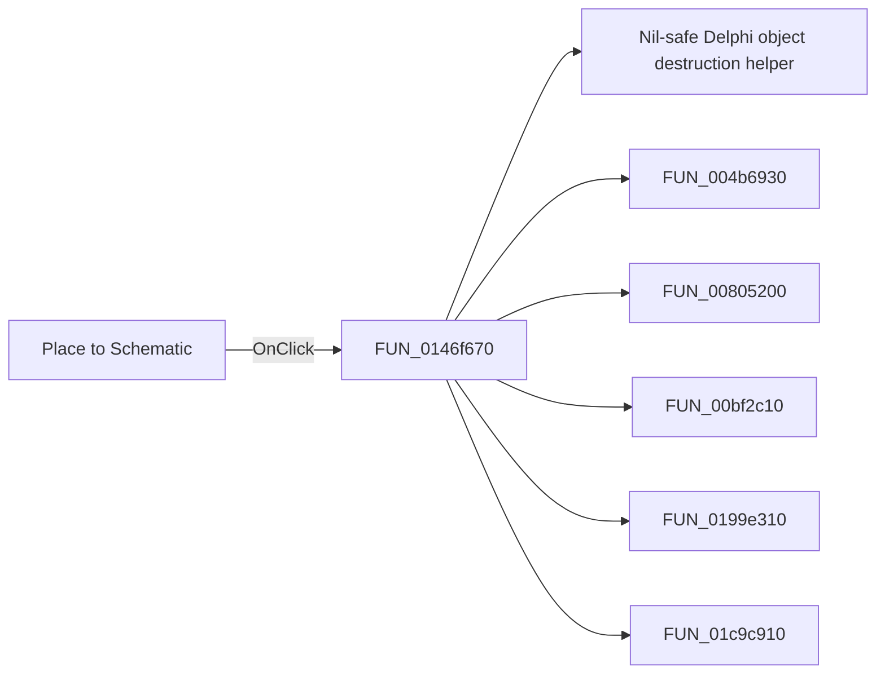

# Place to Schematic

> Analysis status: Pending individual source review.

## Control

| Property | Recovered value |
| --- | --- |
| Form | PyMainForm |
| Component path | PyMainForm.Panel1.Panel2.sbPlace |
| Control class | TSpeedButton |
| Caption | Not present in the recovered resource. |
| Hint | Place to Schematic |
| Text | Not present in the recovered resource. |
| Handler name | sbPlaceClick |
| Handler address | 0146f670 |
| Graph node | `resource:dfm:PyMainForm/PyMainForm.Panel1.Panel2.sbPlace` |
| Handler node | `function:0146f670` |
| Graph layer | UI |

## What happens when clicked

Pending individual analysis. An agent must read the recovered handler source and its relevant callees before it replaces this text.

## Click flow

## Handler evidence

- Source: [DecompiledSources/Tina16/functions/000000000146F670__FUN_0146f670.c](../../../DecompiledSources/Tina16/functions/000000000146F670__FUN_0146f670.c)
- Recovered role: Not present in the recovered resource.
- Current graph summary: Handles 1 Delphi UI event: PyMainForm.Panel1.Panel2.sbPlace.OnClick.
- Current graph behavior: Not present in the recovered resource.
- Current graph evidence: Not present in the recovered resource.
- Complexity: complex
- Distinct outgoing calls: 6

## Direct calls

- `function:00410f20` — Nil-safe Delphi object destruction helper
- `function:004b6930` — FUN_004b6930
- `function:00805200` — FUN_00805200
- `function:00bf2c10` — FUN_00bf2c10
- `function:0199e310` — FUN_0199e310
- `function:01c9c910` — FUN_01c9c910

## Resource evidence

- Kind: Not present in the recovered resource.
- Modal result: Not present in the recovered resource.
- Checked state: Not present in the recovered resource.
- List items: Not present in the recovered resource.
- Image reference: Not present in the recovered resource.
- Extracted glyph: [`0314_PyMainForm_PyMainForm_Panel1_Panel2_sbPlace_Glyph_Data.png`](../../../glyph/0314_PyMainForm_PyMainForm_Panel1_Panel2_sbPlace_Glyph_Data.png)

## Nearby label candidates

Nearby labels are layout candidates only. They are not proof of behavior.

- No same-parent label candidate is available.

## Analysis limits

- Do not infer behavior from the control class, caption, hint, glyph, or nearby label alone.
- Do not replace the pending status until the handler source and relevant call path provide enough evidence.
