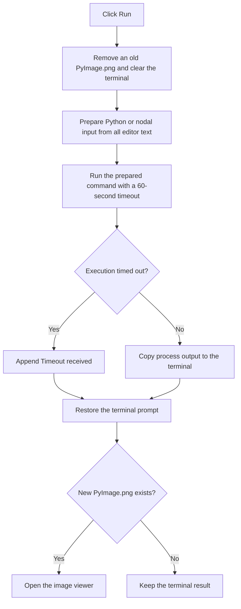

# Run

> Analysis status: Recovered temporary-program, execution, terminal-output, timeout, and image-result path reviewed.

## Control

| Property | Recovered value |
| --- | --- |
| Form | PyMainForm |
| Component path | PyMainForm.Panel1.Panel2.sbRun |
| Control class | TSpeedButton |
| Caption | Not present in the recovered resource. |
| Hint | Run |
| Text | Not present in the recovered resource. |
| Handler name | sbRunClick |
| Handler address | 01470460 |
| Graph node | `resource:dfm:PyMainForm/PyMainForm.Panel1.Panel2.sbRun` |
| Handler node | `function:01470460` |
| Graph layer | UI |

## What happens when clicked

The handler removes a prior `PyImage.png` result when it exists, clears the terminal, resets the execution model, and copies the selected application mode into the model. It reads the complete editor text and prepares either a temporary Python program or a temporary CSV input. Mode 0 builds a Python command; modes 1 and 2 select `nodal-solver.exe` or `nodal-resistance.exe`.

The execution helper runs the prepared command with a recovered 60-second timeout and copies process output to the terminal. A timeout appends `Timeout received`. After execution, the handler restores the terminal prompt. If a new `PyImage.png` exists, it opens the recovered image viewer for that file. The handler does not validate source text before execution and has no local retry or rollback.

## Click flow

## Handler evidence

- Source: [DecompiledSources/Tina16/functions/0000000001470460__FUN_01470460.c](../../../DecompiledSources/Tina16/functions/0000000001470460__FUN_01470460.c)
- Recovered role: Not present in the recovered resource.
- Current graph summary: Handles 1 Delphi UI event: PyMainForm.Panel1.Panel2.sbRun.OnClick.
- Current graph behavior: Not present in the recovered resource.
- Current graph evidence: Not present in the recovered resource.
- Complexity: complex
- Distinct outgoing calls: 11

## Direct calls

- `function:00410f20` — Nil-safe Delphi object destruction helper
- `function:00414560` — Delphi UnicodeString array finalization helper
- `function:00416cd0` — FUN_00416cd0
- `function:00440a20` — FUN_00440a20
- `function:004412f0` — FUN_004412f0
- `function:007fc180` — FUN_007fc180
- `function:013b9dc0` — FUN_013b9dc0
- `function:013bc030` — FUN_013bc030
- `function:013bd980` — FUN_013bd980
- `function:0146cfd0` — FUN_0146cfd0
- `function:01470c80` — FUN_01470c80

## Resource evidence

- Kind: Not present in the recovered resource.
- Modal result: Not present in the recovered resource.
- Checked state: Not present in the recovered resource.
- List items: Not present in the recovered resource.
- Image reference: Not present in the recovered resource.
- Extracted glyph: [`0312_PyMainForm_PyMainForm_Panel1_Panel2_sbRun_Glyph_Data.png`](../../../glyph/0312_PyMainForm_PyMainForm_Panel1_Panel2_sbRun_Glyph_Data.png)

## Nearby label candidates

Nearby labels are layout candidates only. They are not proof of behavior.

- No same-parent label candidate is available.

## Analysis limits

- Do not infer behavior from the control class, caption, hint, glyph, or nearby label alone.
- The recovered source does not prove sandboxing or trust checks before it runs editor-controlled content.
