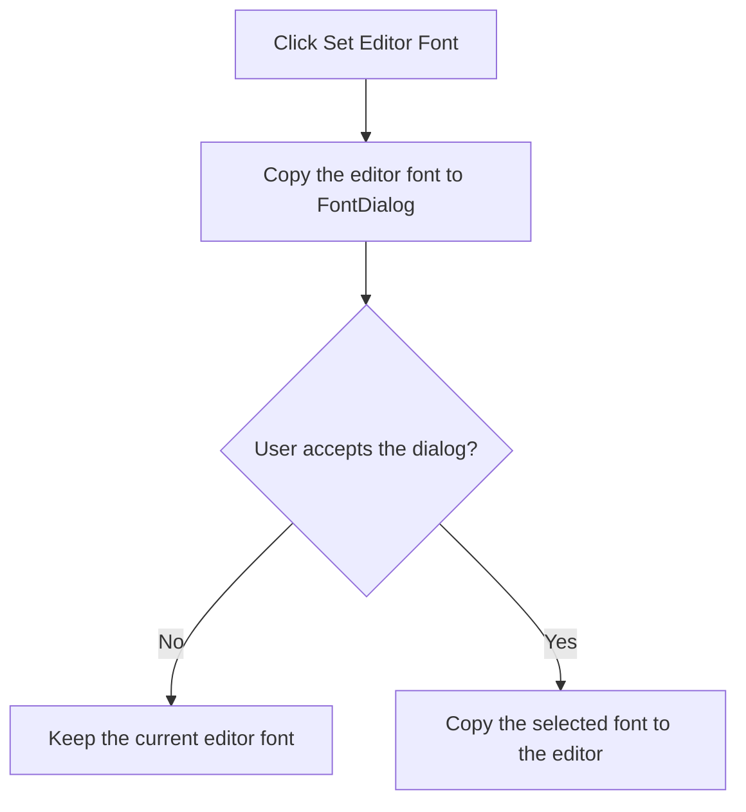

# F

> Analysis status: Recovered font-dialog input, acceptance branch, and editor-font update reviewed.

## Control

| Property | Recovered value |
| --- | --- |
| Form | PyMainForm |
| Component path | PyMainForm.Panel1.Panel2.sbSetFont |
| Control class | TSpeedButton |
| Caption | F |
| Hint | Set Editor Font |
| Text | Not present in the recovered resource. |
| Handler name | sbSetFontClick |
| Handler address | 01470c00 |
| Graph node | `resource:dfm:PyMainForm/PyMainForm.Panel1.Panel2.sbSetFont` |
| Handler node | `function:01470c00` |
| Graph layer | UI |

## What happens when clicked

The handler copies the main editor's current font into `FontDialog` and opens the dialog. If the user accepts, it copies the selected font back to the main editor. If the user cancels, the font stays unchanged.

The click affects the main editor only. It does not change document text, the terminal font, or a saved file. No local catch or persistence step is present.

## Click flow

## Handler evidence

- Source: [DecompiledSources/Tina16/functions/0000000001470C00__FUN_01470c00.c](../../../DecompiledSources/Tina16/functions/0000000001470C00__FUN_01470c00.c)
- Recovered role: Not present in the recovered resource.
- Current graph summary: Handles 1 Delphi UI event: PyMainForm.Panel1.Panel2.sbSetFont.OnClick.
- Current graph behavior: Not present in the recovered resource.
- Current graph evidence: Not present in the recovered resource.
- Complexity: simple
- Distinct outgoing calls: 1

## Direct calls

- `function:00bf2c10` — FUN_00bf2c10

## Resource evidence

- Kind: Not present in the recovered resource.
- Modal result: Not present in the recovered resource.
- Checked state: Not present in the recovered resource.
- List items: Not present in the recovered resource.
- Image reference: Not present in the recovered resource.
- Extracted glyph: None.

## Nearby label candidates

Nearby labels are layout candidates only. They are not proof of behavior.

- No same-parent label candidate is available.

## Analysis limits

- Do not infer behavior from the control class, caption, hint, glyph, or nearby label alone.
- The recovered code does not show whether the selected font is persisted outside this form instance.
