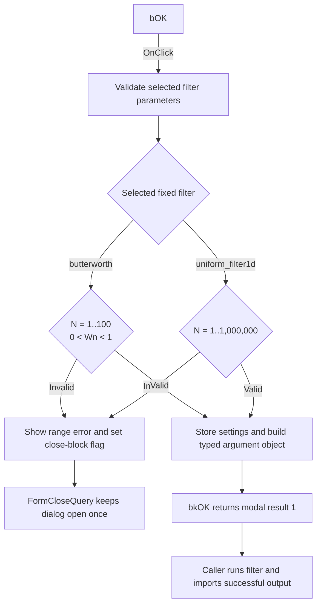

# bOK

> Analysis status: Individually reviewed.

## Control

| Property | Recovered value |
| --- | --- |
| Form | PyProcessForm |
| Component path | PyProcessForm.bOK |
| Control class | TBitBtn |
| Caption | Not present in the recovered resource. |
| Hint | Not present in the recovered resource. |
| Text | Not present in the recovered resource. |
| Handler name | bOKClick |
| Handler address | 01a67250 |
| Graph node | `resource:dfm:PyProcessForm/PyProcessForm.bOK` |
| Handler node | `function:01a67250` |
| Graph layer | UI |

## What happens when clicked

The handler temporarily sets the shared decimal separator to `.` and reads the
filter parameter edits. `FormCreate` supplies only two filter definitions:
`butterworth;N,3,i;Wn,0.03,f` and `uniform_filter1d;N,100,i`.

For `butterworth`, the handler requires integer order `N` in the inclusive
range 1 through 100 and floating-point `Wn` strictly between 0 and 1. For
`uniform_filter1d`, it requires integer `N` in the inclusive range 1 through
1,000,000. It shows the recovered range message when a value is invalid and
sets the form's close-block flag. `FormCloseQuery` rejects that close attempt,
clears the flag, and keeps the dialog open for a correction. No Python argument
object is made on these error paths.

After valid input, the handler updates the shared filter-settings record. It
then builds a typed argument object with the selected filter name under
`filter` and the visible parameter names and values under `N` and, for
Butterworth, `Wn`. It restores the previous decimal separator on both the
success and validation-error paths.

The handler does not run Python and does not read the Curve name or Page name
edits. The button's `bkOK` behavior returns modal result 1 after the close query
allows the dialog to close. The caller then serializes the argument object to
`curve_prop.json`, runs the bundled Process curve workflow, reports a returned
error, or imports the generated curve under the requested names.

## Click flow

## Handler evidence

- Source: [DecompiledSources/Tina16/functions/0000000001A67250__FUN_01a67250.c](../../../DecompiledSources/Tina16/functions/0000000001A67250__FUN_01a67250.c)
- Recovered role: Validates Process curve filter parameters and builds the Python runner argument object.
- Current graph summary: Handles 1 Delphi UI event: PyProcessForm.bOK.OnClick.
- Current graph behavior: Validates the fixed Butterworth or uniform-filter values, records the selected settings, and builds a typed argument object. Invalid values show a message and block one close attempt.
- Current graph evidence: The handler reads edits at form fields `+0x6F8` and `+0x700`, tests the recovered filter names and numeric bounds, calls `FUN_01a671e0` on failure, and assigns the new argument object to form field `+0x768` only on the success path.
- Complexity: complex
- Distinct outgoing calls: 15

## Direct calls

- `function:00414480` — Delphi UnicodeString clear and finalization helper
- `function:00414560` — Delphi UnicodeString array finalization helper
- `function:00416db0` — compares Unicode strings for the recovered filter names and parameter type codes.
- `function:0043fc00` — converts edit text to an integer.
- `function:00442f70` — formats a recovered validation message.
- `function:00448650` — converts edit text to a floating-point value with the active format settings.
- `function:0064dd90` — VCL control Unicode text reader
- `function:00f2e9d0` — wraps the selected filter name as a value object.
- `function:00f2f680` — wraps a floating-point parameter value.
- `function:00f2f8e0` — wraps an integer parameter value.
- `function:00f309b0` — constructs the argument mapping object.
- `function:00f30e70` — inserts a named value into the argument mapping.
- `function:01a671e0` — shows a validation message and sets the close-block flag.
- `function:01a677d0` — restores the saved decimal separator on validation-error paths.
- `function:01a67f30` — parses one parameter's name, default text, and `i` or `f` type code from the fixed filter definition.

## State consumer

- [FUN_01a68310](../../../DecompiledSources/Tina16/functions/0000000001A68310__FUN_01a68310.c) reads the close-block flag during `FormCloseQuery`. It rejects one close attempt after a validation error and then clears the flag.
- [FUN_01a842b0](../../../DecompiledSources/Tina16/functions/0000000001A842B0__FUN_01a842b0.c) opens this form and calls the runner only when `ShowModal` returns 1.
- [FUN_01a68fa0](../../../DecompiledSources/Tina16/functions/0000000001A68FA0__FUN_01a68fa0.c) serializes the argument object, runs the filter, and handles the result after the dialog closes.

## Resource evidence

- Kind: bkOK
- Modal result: Not present in the recovered resource.
- Checked state: Not present in the recovered resource.
- List items: Not present in the recovered resource.
- Image reference: Not present in the recovered resource.
- Extracted glyph: None.

## Nearby label candidates

Nearby labels are layout candidates only. They are not proof of behavior.

- Rank 1: Help at distance 85.
- Rank 2: Page name: at distance 120.
- Rank 3: Curve name: at distance 147.

## Analysis limits

- The source proves the two fixed filter definitions, bounds, state writes,
  validation messages, and argument mapping.
- The click handler does not read Curve name or Page name. The later result
  importer reads those edits after the Python run succeeds.
- The source does not check allocation failures or exceptions from the numeric
  converters or argument-object helpers in this handler.
