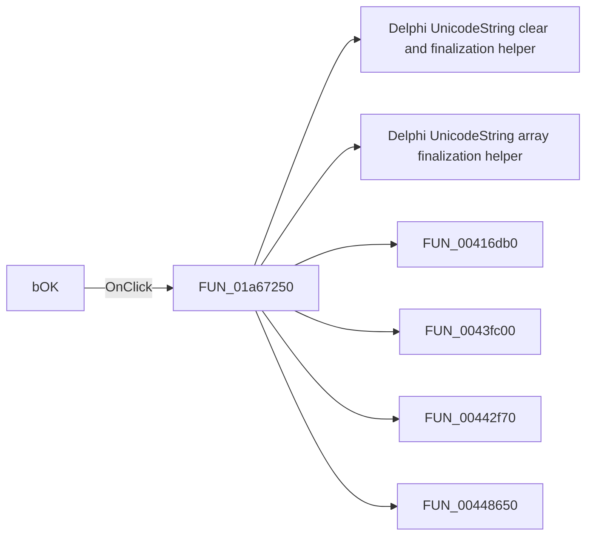

# bOK

> Analysis status: Pending individual source review.

## Control

| Property | Recovered value |
| --- | --- |
| Form | PyProcessForm |
| Component path | PyProcessForm.bOK |
| Control class | TBitBtn |
| Caption | Not present in the recovered resource. |
| Hint | Not present in the recovered resource. |
| Text | Not present in the recovered resource. |
| Handler name | bOKClick |
| Handler address | 01a67250 |
| Graph node | `resource:dfm:PyProcessForm/PyProcessForm.bOK` |
| Handler node | `function:01a67250` |
| Graph layer | UI |

## What happens when clicked

Pending individual analysis. An agent must read the recovered handler source and its relevant callees before it replaces this text.

## Click flow

## Handler evidence

- Source: [DecompiledSources/Tina16/functions/0000000001A67250__FUN_01a67250.c](../../../DecompiledSources/Tina16/functions/0000000001A67250__FUN_01a67250.c)
- Recovered role: Not present in the recovered resource.
- Current graph summary: Handles 1 Delphi UI event: PyProcessForm.bOK.OnClick.
- Current graph behavior: Not present in the recovered resource.
- Current graph evidence: Not present in the recovered resource.
- Complexity: complex
- Distinct outgoing calls: 15

## Direct calls

- `function:00414480` — Delphi UnicodeString clear and finalization helper
- `function:00414560` — Delphi UnicodeString array finalization helper
- `function:00416db0` — FUN_00416db0
- `function:0043fc00` — FUN_0043fc00
- `function:00442f70` — FUN_00442f70
- `function:00448650` — FUN_00448650
- `function:0064dd90` — VCL control Unicode text reader
- `function:00f2e9d0` — FUN_00f2e9d0
- `function:00f2f680` — FUN_00f2f680
- `function:00f2f8e0` — FUN_00f2f8e0
- `function:00f309b0` — FUN_00f309b0
- `function:00f30e70` — FUN_00f30e70
- `function:01a671e0` — FUN_01a671e0
- `function:01a677d0` — FUN_01a677d0
- `function:01a67f30` — FUN_01a67f30

## Resource evidence

- Kind: bkOK
- Modal result: Not present in the recovered resource.
- Checked state: Not present in the recovered resource.
- List items: Not present in the recovered resource.
- Image reference: Not present in the recovered resource.
- Extracted glyph: None.

## Nearby label candidates

Nearby labels are layout candidates only. They are not proof of behavior.

- Rank 1: Help at distance 85.
- Rank 2: Page name: at distance 120.
- Rank 3: Curve name: at distance 147.

## Analysis limits

- Do not infer behavior from the control class, caption, hint, glyph, or nearby label alone.
- Do not replace the pending status until the handler source and relevant call path provide enough evidence.
