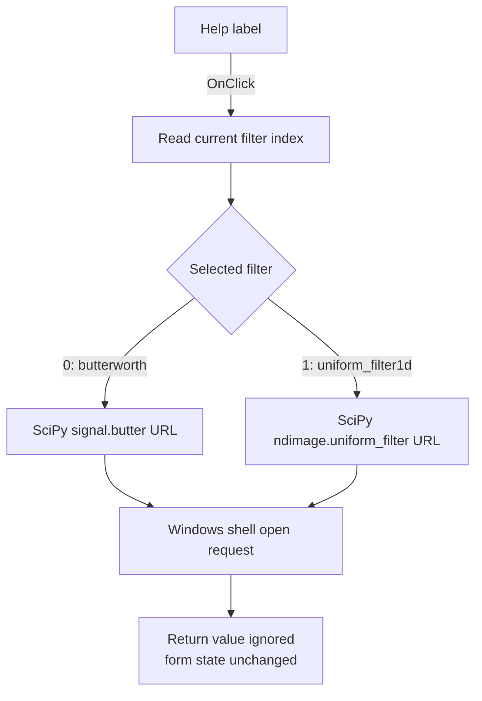

# Help

> Analysis status: Individually reviewed.

## Control

| Property | Recovered value |
| --- | --- |
| Form | PyProcessForm |
| Component path | PyProcessForm.lHelp |
| Control class | TLabel |
| Caption | Help |
| Hint | Not present in the recovered resource. |
| Text | Not present in the recovered resource. |
| Handler name | lHelpClick |
| Handler address | 01a68080 |
| Graph node | `resource:dfm:PyProcessForm/PyProcessForm.lHelp` |
| Handler node | `function:01a68080` |
| Graph layer | UI |

## What happens when clicked

The handler reads the current index from the Filter combo box and uses that
same index in the form's help-URL list. `FormCreate` keeps both lists in the
same order. Index 0 opens the SciPy `signal.butter` reference for the
Butterworth filter. Index 1 opens the SciPy `ndimage.uniform_filter` reference
for the uniform filter.

The handler passes the selected URL to the recovered Windows shell thunk with
the `open` operation, no arguments, no working directory, and show value 1. It
does not check the shell result. The click does not change the selected filter,
edit any parameters, run the filter, or close the form. A shell or browser
failure therefore has no recovered in-application error path.

## Click flow

## Handler evidence

- Source: [DecompiledSources/Tina16/functions/0000000001A68080__FUN_01a68080.c](../../../DecompiledSources/Tina16/functions/0000000001A68080__FUN_01a68080.c)
- Recovered role: Opens the SciPy reference page for the selected Process curve filter.
- Current graph summary: Handles 1 Delphi UI event: PyProcessForm.lHelp.OnClick.
- Current graph behavior: Maps the selected filter index to its stored reference URL and requests that the Windows shell open it. It ignores the shell result.
- Current graph evidence: The handler reads `cbFilters.ItemIndex` at form field `+0x6B0`, retrieves the same index from the URL list at `+0x740`, and calls the shared shell thunk with `open`, the URL, null parameters, null directory, and show value 1.
- Complexity: moderate
- Distinct outgoing calls: 2

## Direct calls

- `function:00414480` — Delphi UnicodeString clear and finalization helper
- `function:00416740` — returns a nil-safe pointer to the selected Unicode URL.

The recovered source also calls the indirect shell thunk
`thunk_FUN_0419adcc`. The graph does not emit an edge for this indirect import
call. Parallel recovered handlers and its arguments identify the thunk as the
Windows shell open operation.

## Resource evidence

- Kind: Not present in the recovered resource.
- Modal result: Not present in the recovered resource.
- Checked state: Not present in the recovered resource.
- List items: Not present in the recovered resource.
- Image reference: Not present in the recovered resource.
- Extracted glyph: None.

## Nearby label candidates

Nearby labels are layout candidates only. They are not proof of behavior.

- Rank 1: Help at distance 0.
- Rank 2: Page name: at distance 35.
- Rank 3: Curve name: at distance 62.

## Analysis limits

- Form initialization proves the two URL values and their order relative to
  the filter definitions.
- The handler has no branch for a shell failure and does not inspect the return
  value.
- The source has no in-application fallback if the system cannot open the URL.
