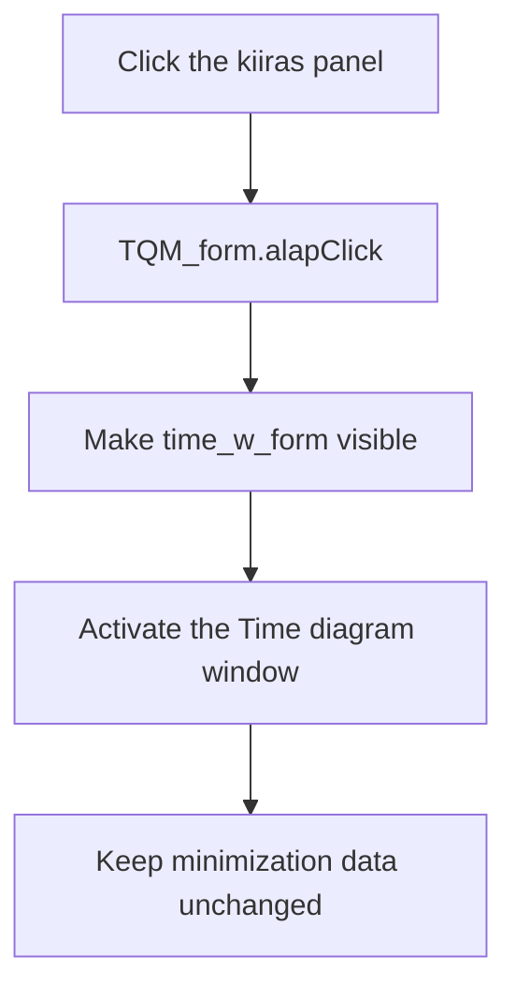

# kiiras

> Analysis status: Reviewed against the recovered handler, form-display helper, and form creation resources.

## Control

| Property | Recovered value |
| --- | --- |
| Form | QM_form |
| Component path | QM_form.alap |
| Control class | TPanel |
| Caption | kiiras |
| Hint | Not present in the recovered resource. |
| Text | Not present in the recovered resource. |
| Handler name | alapClick |
| Handler address | 011a5060 |
| Graph node | `resource:dfm:QM_form/QM_form.alap` |
| Handler node | `function:011a5060` |
| Graph layer | UI |

## What happens when clicked

The handler passes the global `time_w_form` instance to `FUN_008059a0`. That helper makes the form visible and activates it, which brings the `Time diagram` window to the front.

The click does not recalculate the diagram, change the panel caption, or alter minimization input. The panel starts hidden with the recovered caption `kiiras`; other runtime code can change its state before it becomes available.

## Click flow

## Handler evidence

- Source: [DecompiledSources/Tina16/functions/00000000011A5060__FUN_011a5060.c](../../../DecompiledSources/Tina16/functions/00000000011A5060__FUN_011a5060.c)
- Recovered role: Show and activate the Time diagram window.
- Current graph summary: Handles 1 Delphi UI event: QM_form.alap.OnClick.
- Current graph behavior: Not present in the recovered resource.
- Current graph evidence: Not present in the recovered resource.
- Complexity: simple
- Distinct outgoing calls: 1

## Direct calls

- `function:008059a0` — FUN_008059a0

## Resource evidence

- Kind: Not present in the recovered resource.
- Modal result: Not present in the recovered resource.
- Checked state: Not present in the recovered resource.
- List items: Not present in the recovered resource.
- Image reference: Not present in the recovered resource.
- Extracted glyph: None.

## Nearby label candidates

Nearby labels are layout candidates only. They are not proof of behavior.

- No same-parent label candidate is available.

## Analysis limits

- The recovered handler does not explain when the hidden panel becomes visible.
- The click only displays the existing diagram form. It does not prove that the diagram is current.
