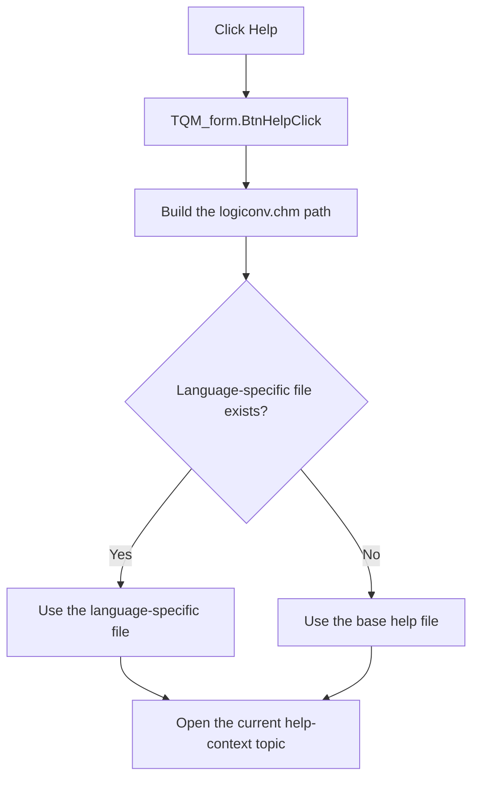

# &Help

> Analysis status: Reviewed against the recovered handler, help-file selector, and form help-context sources.

## Control

| Property | Recovered value |
| --- | --- |
| Form | QM_form |
| Component path | QM_form.GroupBox1.BtnHelp |
| Control class | TBitBtn |
| Caption | &Help |
| Hint | Not present in the recovered resource. |
| Text | Not present in the recovered resource. |
| Handler name | BtnHelpClick |
| Handler address | 011a4f60 |
| Graph node | `resource:dfm:QM_form/QM_form.GroupBox1.BtnHelp` |
| Handler node | `function:011a4f60` |
| Graph layer | UI |

## What happens when clicked

The handler builds the path to `logiconv.chm`. It asks `FUN_01b1def0` to select an existing language-specific file when one is available. It otherwise uses the base help file. It then opens the topic that is identified by the current shared help-context ID.

This control does not select a topic itself. Other QM form handlers set the shared ID. The form uses `4000` by default, while Start, Minterm, Show Details, and Maxterm select their own context IDs. The recovered Help glyph supports the help-entry purpose, but the handler and callee establish the file and topic behavior.

## Click flow

## Handler evidence

- Source: [DecompiledSources/Tina16/functions/00000000011A4F60__FUN_011a4f60.c](../../../DecompiledSources/Tina16/functions/00000000011A4F60__FUN_011a4f60.c)
- Recovered role: Open the current Quine-McCluskey help topic.
- Current graph summary: Handles 1 Delphi UI event: QM_form.GroupBox1.BtnHelp.OnClick.
- Current graph behavior: Not present in the recovered resource.
- Current graph evidence: Not present in the recovered resource.
- Complexity: complex
- Distinct outgoing calls: 3

## Direct calls

- `function:00414560` — Delphi UnicodeString array finalization helper
- `function:00416cd0` — FUN_00416cd0
- `function:01b1def0` — FUN_01b1def0

## Resource evidence

- Kind: Not present in the recovered resource.
- Modal result: Not present in the recovered resource.
- Checked state: Not present in the recovered resource.
- List items: Not present in the recovered resource.
- Image reference: Not present in the recovered resource.
- Extracted glyph: [`0315_QM_form_QM_form_GroupBox1_BtnHelp_Glyph_Data.png`](../../../glyph/0315_QM_form_QM_form_GroupBox1_BtnHelp_Glyph_Data.png)

## Nearby label candidates

Nearby labels are layout candidates only. They are not proof of behavior.

- Rank 1: Minterms/Maxterm index at distance 568.
- Rank 2: Number of variables: at distance 608.

## Analysis limits

- The language-specific file name depends on the file-selection helper and the files that exist at run time.
- The handler uses the current shared context. It does not prove which command most recently set that context.
