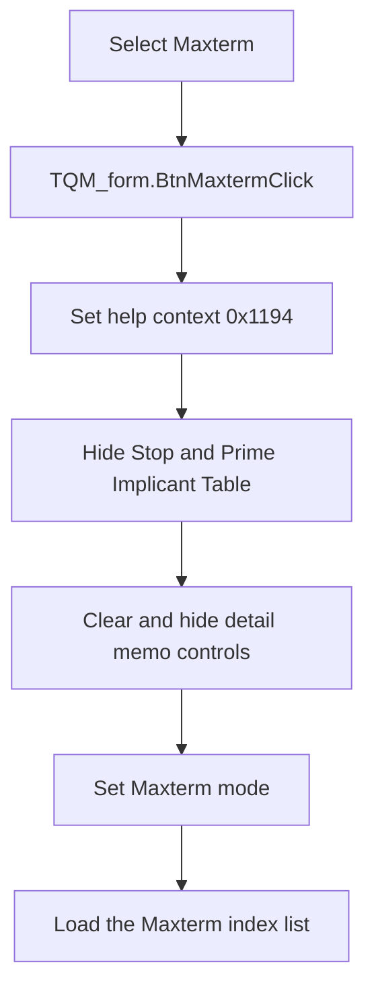

# Maxterm

> Analysis status: Reviewed against the recovered handler, detail-reset callee, and QM form resources.

## Control

| Property | Recovered value |
| --- | --- |
| Form | QM_form |
| Component path | QM_form.GroupBox1.BtnMaxterm |
| Control class | TRadioButton |
| Caption | Maxterm |
| Hint | Not present in the recovered resource. |
| Text | Not present in the recovered resource. |
| Handler name | BtnMaxtermClick |
| Handler address | 011a4ea0 |
| Graph node | `resource:dfm:QM_form/QM_form.GroupBox1.BtnMaxterm` |
| Handler node | `function:011a4ea0` |
| Graph layer | UI |

## What happens when clicked

The handler selects Maxterm input mode. It stores help-context ID `0x1194`, hides the Stop control, hides the Prime Implicant Table form, and calls `FUN_01199b90` to clear and hide the triangular detail memo controls. It sets the recovered mode byte to `0` and copies the model's Maxterm index list into the input memo.

The standard radio-button processing changes the checked state before this event runs. A repeated click performs the same reset. This handler does not start minimization.

## Click flow

## Handler evidence

- Source: [DecompiledSources/Tina16/functions/00000000011A4EA0__FUN_011a4ea0.c](../../../DecompiledSources/Tina16/functions/00000000011A4EA0__FUN_011a4ea0.c)
- Recovered role: Select Maxterm input mode and reset prior detail views.
- Current graph summary: Handles 1 Delphi UI event: QM_form.GroupBox1.BtnMaxterm.OnClick.
- Current graph behavior: Not present in the recovered resource.
- Current graph evidence: Not present in the recovered resource.
- Complexity: complex
- Distinct outgoing calls: 4

## Direct calls

- `function:0064dbe0` — FUN_0064dbe0
- `function:0064de00` — VCL control text setter with change suppression
- `function:00805990` — FUN_00805990
- `function:01199b90` — FUN_01199b90

## Resource evidence

- Kind: Not present in the recovered resource.
- Modal result: Not present in the recovered resource.
- Checked state: Not present in the recovered resource.
- List items: Not present in the recovered resource.
- Image reference: Not present in the recovered resource.
- Extracted glyph: None.

## Nearby label candidates

Nearby labels are layout candidates only. They are not proof of behavior.

- Rank 1: Minterms/Maxterm index at distance 72.
- Rank 2: Number of variables: at distance 112.

## Analysis limits

- The recovered mode field has no Delphi field name.
- The handler copies the existing model list. It does not validate or minimize the entered terms.
