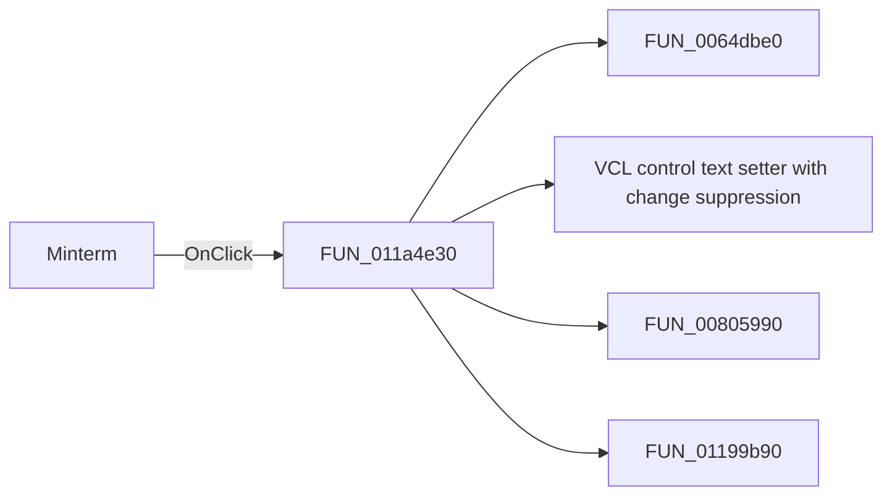

# Minterm

> Analysis status: Pending individual source review.

## Control

| Property | Recovered value |
| --- | --- |
| Form | QM_form |
| Component path | QM_form.GroupBox1.Btnminterm |
| Control class | TRadioButton |
| Caption | Minterm |
| Hint | Not present in the recovered resource. |
| Text | Not present in the recovered resource. |
| Handler name | BtnmintermClick |
| Handler address | 011a4e30 |
| Graph node | `resource:dfm:QM_form/QM_form.GroupBox1.Btnminterm` |
| Handler node | `function:011a4e30` |
| Graph layer | UI |

## What happens when clicked

Pending individual analysis. An agent must read the recovered handler source and its relevant callees before it replaces this text.

## Click flow

## Handler evidence

- Source: [DecompiledSources/Tina16/functions/00000000011A4E30__FUN_011a4e30.c](../../../DecompiledSources/Tina16/functions/00000000011A4E30__FUN_011a4e30.c)
- Recovered role: Not present in the recovered resource.
- Current graph summary: Handles 1 Delphi UI event: QM_form.GroupBox1.Btnminterm.OnClick.
- Current graph behavior: Not present in the recovered resource.
- Current graph evidence: Not present in the recovered resource.
- Complexity: complex
- Distinct outgoing calls: 4

## Direct calls

- `function:0064dbe0` — FUN_0064dbe0
- `function:0064de00` — VCL control text setter with change suppression
- `function:00805990` — FUN_00805990
- `function:01199b90` — FUN_01199b90

## Resource evidence

- Kind: Not present in the recovered resource.
- Modal result: Not present in the recovered resource.
- Checked state: true
- List items: Not present in the recovered resource.
- Image reference: Not present in the recovered resource.
- Extracted glyph: None.

## Nearby label candidates

Nearby labels are layout candidates only. They are not proof of behavior.

- Rank 1: Minterms/Maxterm index at distance 56.
- Rank 2: Number of variables: at distance 96.

## Analysis limits

- Do not infer behavior from the control class, caption, hint, glyph, or nearby label alone.
- Do not replace the pending status until the handler source and relevant call path provide enough evidence.
