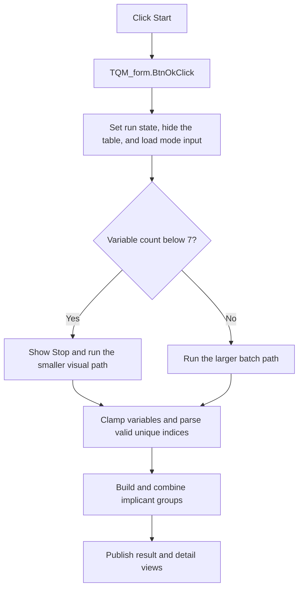

# Start

> Analysis status: Reviewed against the recovered handler, both minimization initializers, and their calculation callees.

## Control

| Property | Recovered value |
| --- | --- |
| Form | QM_form |
| Component path | QM_form.GroupBox1.BtnOk |
| Control class | TBitBtn |
| Caption | Start |
| Hint | Not present in the recovered resource. |
| Text | Not present in the recovered resource. |
| Handler name | BtnOkClick |
| Handler address | 011a4d50 |
| Graph node | `resource:dfm:QM_form/QM_form.GroupBox1.BtnOk` |
| Handler node | `function:011a4d50` |
| Graph layer | UI |

## What happens when clicked

The handler starts Quine-McCluskey minimization for the current mode and inputs. It stores help-context ID `0x1004`, sets a recovered run field, hides the Prime Implicant Table, and copies the selected Minterm or Maxterm index list into the input memo.

The handler selects one of two calculation paths from the configured variable count. Counts below seven use `FUN_011a23d0`: this path shows the Stop control and enables the related model control after the call returns. Larger counts use `FUN_011a32b0`. Both paths clear work state, read and clamp the variable count, parse the comma-separated index list, skip duplicate and out-of-range values, build implicant groups, and run the matching combination engine. Later calls publish result and detail views, including the Prime Implicant Table and time diagram.

The parser has recovered scan limits of 128 tokens in the smaller path and 255 tokens in the larger path. The exact behavior for malformed numeric text is not recovered. The custom handler does not save settings and has no local error dialog.

## Click flow

## Handler evidence

- Source: [DecompiledSources/Tina16/functions/00000000011A4D50__FUN_011a4d50.c](../../../DecompiledSources/Tina16/functions/00000000011A4D50__FUN_011a4d50.c)
- Recovered role: Start Quine-McCluskey minimization for the current inputs.
- Current graph summary: Handles 1 Delphi UI event: QM_form.GroupBox1.BtnOk.OnClick.
- Current graph behavior: Not present in the recovered resource.
- Current graph evidence: Not present in the recovered resource.
- Complexity: complex
- Distinct outgoing calls: 5

## Direct calls

- `function:0064dbe0` — FUN_0064dbe0
- `function:0064de00` — VCL control text setter with change suppression
- `function:00805990` — FUN_00805990
- `function:011a23d0` — FUN_011a23d0
- `function:011a32b0` — FUN_011a32b0

## Resource evidence

- Kind: bkOK
- Modal result: Not present in the recovered resource.
- Checked state: Not present in the recovered resource.
- List items: Not present in the recovered resource.
- Image reference: Not present in the recovered resource.
- Extracted glyph: None.

## Nearby label candidates

Nearby labels are layout candidates only. They are not proof of behavior.

- Rank 1: Minterms/Maxterm index at distance 312.
- Rank 2: Number of variables: at distance 352.

## Analysis limits

- Names for the work arrays and recovered run field are not available.
- The recovered source does not establish the precise result for malformed numeric input.
