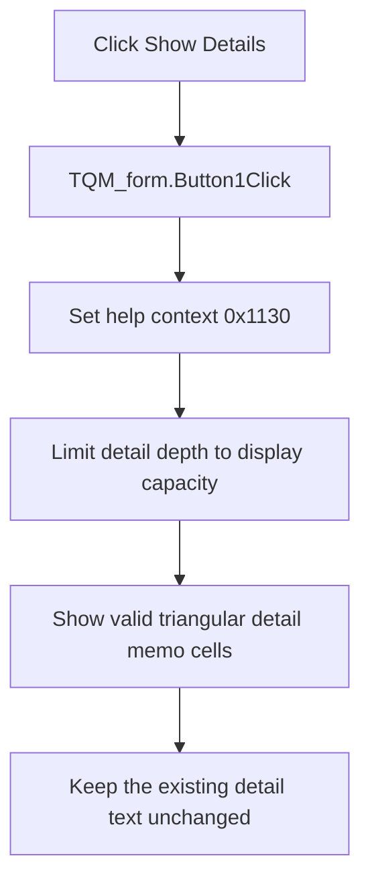

# Show Details

> Analysis status: Reviewed against the recovered handler and mapped detail controls.

## Control

| Property | Recovered value |
| --- | --- |
| Form | QM_form |
| Component path | QM_form.GroupBox1.BtnShowres |
| Control class | TButton |
| Caption | Show Details |
| Hint | Not present in the recovered resource. |
| Text | Not present in the recovered resource. |
| Handler name | Button1Click |
| Handler address | 011a4bd0 |
| Graph node | `resource:dfm:QM_form/QM_form.GroupBox1.BtnShowres` |
| Handler node | `function:011a4bd0` |
| Graph layer | UI |

## What happens when clicked

The handler stores help-context ID `0x1130` and calculates a safe detail depth from the current stage count and the display capacity. It then makes the applicable triangular detail memo controls visible. The first tier can show one more cell than the second tier, and each later tier can show one fewer cell through the seventh tier.

This action reveals detail text that the minimization path already populated. It does not calculate, clear, or rewrite that text. A repeated click leaves the same controls visible. Counts below the display capacity leave the later tiers hidden.

## Click flow

## Handler evidence

- Source: [DecompiledSources/Tina16/functions/00000000011A4BD0__FUN_011a4bd0.c](../../../DecompiledSources/Tina16/functions/00000000011A4BD0__FUN_011a4bd0.c)
- Recovered role: Reveal populated Quine-McCluskey stage details.
- Current graph summary: Handles 1 Delphi UI event: QM_form.GroupBox1.BtnShowres.OnClick.
- Current graph behavior: Not present in the recovered resource.
- Current graph evidence: Not present in the recovered resource.
- Complexity: simple
- Distinct outgoing calls: 1

## Direct calls

- `function:0064dbe0` — FUN_0064dbe0

## Resource evidence

- Kind: Not present in the recovered resource.
- Modal result: Not present in the recovered resource.
- Checked state: Not present in the recovered resource.
- List items: Not present in the recovered resource.
- Image reference: Not present in the recovered resource.
- Extracted glyph: None.

## Nearby label candidates

Nearby labels are layout candidates only. They are not proof of behavior.

- Rank 1: Minterms/Maxterm index at distance 183.
- Rank 2: Number of variables: at distance 223.

## Analysis limits

- The recovered global counters do not have Delphi field names.
- Visibility does not prove that every applicable memo contains non-empty text.
