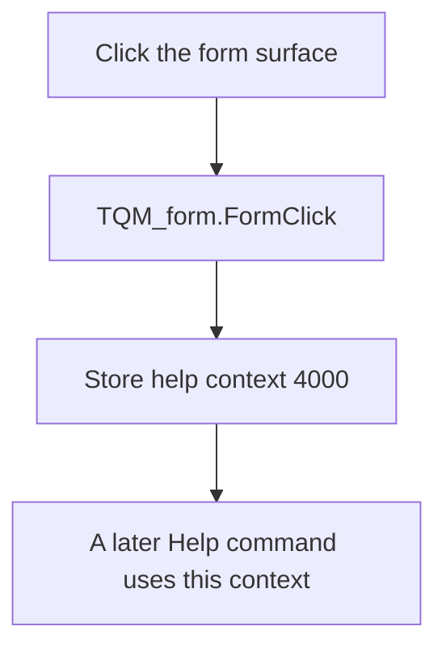

# Quine-McCluskey method

> Analysis status: Reviewed against the recovered handler and form lifecycle sources.

## Control

| Property | Recovered value |
| --- | --- |
| Form | QM_form |
| Component path | QM_form |
| Control class | TQM_form |
| Caption | Quine-McCluskey method |
| Hint | Not present in the recovered resource. |
| Text | Not present in the recovered resource. |
| Handler name | FormClick |
| Handler address | 011a5050 |
| Graph node | `resource:dfm:QM_form` |
| Handler node | `function:011a5050` |
| Graph layer | UI |

## What happens when clicked

The handler stores help-context ID `4000` in the shared help-context field. This prepares the Quine-McCluskey form topic for a later Help command. It does not open help, start minimization, or change the form inputs.

The form activation path also restores ID `4000`. The form Help handler later passes the current shared ID and `logiconv.chm` to the help service. A command control can replace this ID before the user requests help.

## Click flow

## Handler evidence

- Source: [DecompiledSources/Tina16/functions/00000000011A5050__FUN_011a5050.c](../../../DecompiledSources/Tina16/functions/00000000011A5050__FUN_011a5050.c)
- Recovered role: Quine-McCluskey form help-context selection handler
- Current graph summary: Restores help-context ID 4000 when the Quine-McCluskey form surface is clicked. It prepares the form help topic without opening help or changing minimization data. Handles 1 Delphi UI event: QM_form.OnClick.
- Current graph behavior: Restores help-context ID 4000 when the Quine-McCluskey form surface is clicked. It prepares the form help topic without opening help or changing minimization data.
- Current graph evidence: QM_form.OnClick binds FormClick to this single-store function. QM_form activation also stores 4000, and its OnHelp handler passes the shared value with logiconv.chm to the help service.
- Complexity: simple
- Distinct outgoing calls: 0

## Direct calls

- No direct call edge is present in the recovered graph.

## Resource evidence

- Kind: Not present in the recovered resource.
- Modal result: Not present in the recovered resource.
- Checked state: Not present in the recovered resource.
- List items: Not present in the recovered resource.
- Image reference: Not present in the recovered resource.
- Extracted glyph: None.

## Nearby label candidates

Nearby labels are layout candidates only. They are not proof of behavior.

- No same-parent label candidate is available.

## Analysis limits

- The recovered handler is a single field store. It has no direct call edge.
- The exact Delphi field name for the shared help context is not recovered.
