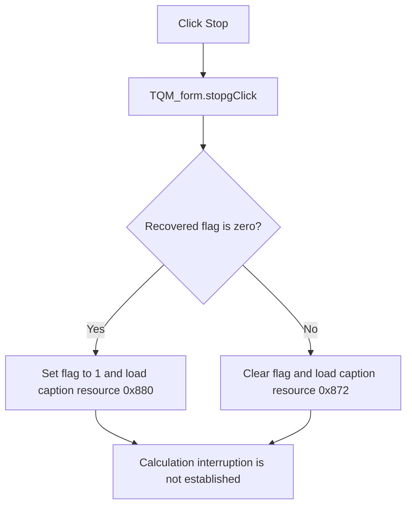

# Stop

> Analysis status: Reviewed against the recovered handler, reset helper, and all recovered accesses to the shared flag.

## Control

| Property | Recovered value |
| --- | --- |
| Form | QM_form |
| Component path | QM_form.Stopg |
| Control class | TButton |
| Caption | Stop |
| Hint | Not present in the recovered resource. |
| Text | Not present in the recovered resource. |
| Handler name | stopgClick |
| Handler address | 011a2340 |
| Graph node | `resource:dfm:QM_form/QM_form.Stopg` |
| Handler node | `function:011a2340` |
| Graph layer | UI |

## What happens when clicked

The handler toggles a recovered global run-control byte and changes this button's caption. When the byte is zero, it sets the byte to one and loads string resource `0x880`. Otherwise, it calls `FUN_0119a380`, which clears the byte and loads string resource `0x872`.

The Start and minimization initialization paths also set the byte to one and load resource `0x880`. Calculation-stage code calls the reset helper at stage boundaries. However, the recovered source contains no read of this byte that interrupts, pauses, or stops the calculation. The proven effect is limited to the flag and caption states. The exact localized text for resource IDs `0x880` and `0x872` is not recovered.

## Click flow

## Handler evidence

- Source: [DecompiledSources/Tina16/functions/00000000011A2340__FUN_011a2340.c](../../../DecompiledSources/Tina16/functions/00000000011A2340__FUN_011a2340.c)
- Recovered role: Toggle the recovered Quine-McCluskey run-control flag and caption state.
- Current graph summary: Handles 1 Delphi UI event: QM_form.Stopg.OnClick.
- Current graph behavior: Not present in the recovered resource.
- Current graph evidence: Not present in the recovered resource.
- Complexity: complex
- Distinct outgoing calls: 5

## Direct calls

- `function:00414480` — Delphi UnicodeString clear and finalization helper
- `function:0064de00` — VCL control text setter with change suppression
- `function:00b89270` — FUN_00b89270
- `function:00b8e520` — FUN_00b8e520
- `function:0119a380` — FUN_0119a380

## Resource evidence

- Kind: Not present in the recovered resource.
- Modal result: Not present in the recovered resource.
- Checked state: Not present in the recovered resource.
- List items: Not present in the recovered resource.
- Image reference: Not present in the recovered resource.
- Extracted glyph: None.

## Nearby label candidates

Nearby labels are layout candidates only. They are not proof of behavior.

- No same-parent label candidate is available.

## Analysis limits

- No recovered source reads the flag to interrupt, pause, or stop calculation.
- The localized strings for resource IDs `0x880` and `0x872` are not recovered.
