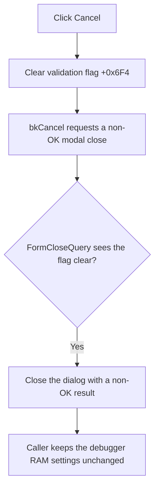

# Cancel RAM display edits and allow the dialog to close

> Analysis status: Source and call path reviewed.

## Control

| Property | Recovered value |
| --- | --- |
| Form | RamDisplaySettings |
| Component path | RamDisplaySettings.Cancel |
| Control class | TBitBtn |
| Kind | bkCancel |
| Handler name | CancelClick |
| Handler address | 00f87620 |
| Graph node | `resource:dfm:RamDisplaySettings/RamDisplaySettings.Cancel` |
| Handler node | `function:00f87620` |
| Graph layer | UI |

## What happens when clicked

The handler clears form byte `+0x6F4` and returns. This byte is the dialog's validation-error and close-rejection flag. The form-create handler also initializes it to zero. The form's `OnCloseQuery` handler permits a close only while the byte is zero.

This write is important after an invalid OK attempt. The OK handler sets `+0x6F4` when either `Display Begin` or `Display Size` is invalid, and `OnCloseQuery` then keeps the dialog open. A later Cancel click clears the flag before the `bkCancel` button requests its normal non-OK modal close.

Cancel does not restore either editor or clear the parsed staging fields at `+0x700` and `+0x704`. The callers protect the real debugger settings by checking the modal result: they copy those two fields back only for result `mrOk` (`1`). A Cancel result therefore destroys the dialog without committing its staged values.

The handler is idempotent when the flag is already clear. It has no call, branch, error message, exception recovery, model write, file write, or RAM-view refresh.

## Click flow

## Handler evidence

- [Cancel click handler](../../../DecompiledSources/Tina16/functions/0000000000F87620__FUN_00f87620.c): writes zero to form byte `+0x6F4` and returns.
- [Form close-query handler](../../../DecompiledSources/Tina16/functions/0000000000F87630__FUN_00f87630.c): sets `CanClose` to true only when `+0x6F4` is zero.
- [Form-create handler](../../../DecompiledSources/Tina16/functions/0000000000F87610__FUN_00f87610.c): initializes the same flag to zero.
- [FlowChart debugger coordinator](../../../DecompiledSources/Tina16/functions/0000000000F8F8A0__FUN_00f8f8a0.c): copies staged begin and size values to the current memory-bank record only for modal result `1`.
- [MCU project caller](../../../DecompiledSources/Tina16/functions/000000000108A9E0__FUN_0108a9e0.c): also copies the two accepted values only for modal result `1`; it refreshes its RAM view after either result.

## Direct calls

- No direct call edge is present. The handler performs one byte write.

## Resource evidence

- Kind: `bkCancel`.
- NumGlyphs: `2`.
- Caption, hint, image reference, and extracted glyph: Not present in the recovered resource.
- UI evidence: [Recovered DFM resource data](../../../DecompiledSources/Tina16/resources/dfm/ui-evidence.json).

The button kind establishes the modal Cancel request. The source and caller checks establish the close-veto reset and discard behavior.

## Analysis limits

- Cancel leaves the dialog's staged fields unchanged until the dialog object is destroyed. The no-commit guarantee comes from the two recovered callers, not from a field rollback in `CancelClick`.
- Other possible callers are not connected in the recovered graph. The handler itself only clears `+0x6F4`.
