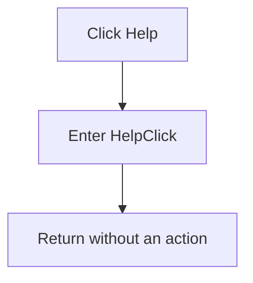

# No-op RAM display Help command

> Analysis status: Source and call path reviewed.

## Control

| Property | Recovered value |
| --- | --- |
| Form | RamDisplaySettings |
| Component path | RamDisplaySettings.Help |
| Control class | TBitBtn |
| Kind | bkHelp |
| Handler name | HelpClick |
| Handler address | 00f872e0 |
| Graph node | `resource:dfm:RamDisplaySettings/RamDisplaySettings.Help` |
| Handler node | `function:00f872e0` |
| Graph layer | UI |

## What happens when clicked

The recovered handler returns immediately. It does not inspect `Sender`, open a help topic, call the application help system, show a message, change either RAM editor, change the validation flag, or close the dialog.

The DFM marks the button as `bkHelp`, but that resource property does not establish implemented help content. The resolved `OnClick` body and empty call neighborhood show that this application handler is a no-op.

Repeated clicks have the same no-op result. There is no decision, output, local error behavior, or exception recovery.

## Click flow

## Handler evidence

- [Help click handler](../../../DecompiledSources/Tina16/functions/0000000000F872E0__FUN_00f872e0.c): contains only a return instruction.
- The knowledge graph shows no outgoing call from `function:00f872e0`.

## Direct calls

- No direct call edge is present.

## Resource evidence

- Kind: `bkHelp`.
- NumGlyphs: `2`.
- Caption, hint, image reference, and extracted glyph: Not present in the recovered resource.
- UI evidence: [Recovered DFM resource data](../../../DecompiledSources/Tina16/resources/dfm/ui-evidence.json).

## Analysis limits

- The source proves that the assigned application handler is a no-op. It does not prove why help content was not implemented.
- No separate inherited help dispatch is present in the recovered handler call path.
