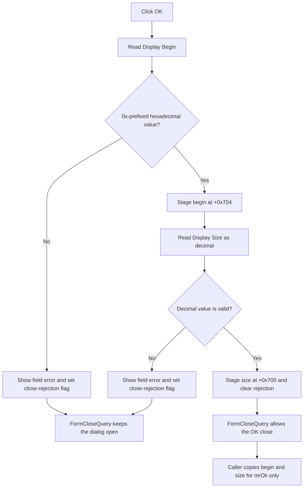

# Validate and stage the RAM display begin and size

> Analysis status: Source and call path reviewed.

## Control

| Property | Recovered value |
| --- | --- |
| Form | RamDisplaySettings |
| Component path | RamDisplaySettings.OK |
| Control class | TBitBtn |
| Kind | bkOK |
| Handler name | OKClick |
| Handler address | 00f873d0 |
| Graph node | `resource:dfm:RamDisplaySettings/RamDisplaySettings.OK` |
| Handler node | `function:00f873d0` |
| Graph layer | UI |

## What happens when clicked

The OK handler validates the two text editors in order and stages their parsed integer values in the dialog:

1. It reads `Display Begin` from `eRamBegin` at form offset `+0x6C8`.
2. It requires the recovered `0x` prefix and at least one following hexadecimal digit.
3. On success, it stores the parsed value at dialog offset `+0x704`.
4. It then reads `Display Size` from `eRamSize` at `+0x6D0`.
5. It validates and converts the size as a decimal integer.
6. On success, it stores the parsed value at dialog offset `+0x700`.

`OnShow` performs the inverse presentation: it writes begin as `0x` plus hexadecimal text with a four-digit minimum width, and it writes size as decimal text.

## Validation errors and close behavior

Each parser call first initializes temporary output field `+0x6F0` to `-1`. The OK handler sets close-rejection byte `+0x6F4` when a parse fails.

If begin is invalid, the handler does not parse size. It loads localized message resource `0x131`, formats it with the `Display Begin` label, and shows the message. If begin is valid but size is invalid, the staged begin remains at `+0x704`; the handler formats the same message resource with the `Display Size` label.

`FormCloseQuery` permits closing only while `+0x6F4` is clear. Therefore, invalid input keeps the modal dialog open. A later valid OK attempt clears the flag and can close it. Cancel also clears the flag so the user can discard an invalid attempt.

The `bkOK` button supplies the normal OK modal request. The handler itself does not copy values to a debugger object. Recovered callers copy `+0x704` and `+0x700` to their RAM display state only when the modal result is `mrOk` (`1`). Thus, even a begin value staged before an invalid size is not committed unless a later attempt completes successfully.

## Accepted-value boundaries

The caller also stages physical RAM base and capacity values in dialog fields `+0x6F8` and `+0x6FC`. The recovered OK handler does not read those fields. It does not clamp the begin or size, compare the requested range with the physical bank end, or reject zero size. Its recovered checks establish numeric syntax and conversion only.

The accepted values update the current in-memory RAM display record. This handler does not write an INI file, registry value, project file, source file, device, or target RAM.

## Click flow

## Handler evidence

- [OK click handler](../../../DecompiledSources/Tina16/functions/0000000000F873D0__FUN_00f873d0.c): reads both editors, calls the parser in hexadecimal and decimal modes, stages the outputs, formats field errors, and updates byte `+0x6F4`.
- [Numeric parser](../../../DecompiledSources/Tina16/functions/0000000000F87190__FUN_00f87190.c): requires the recovered hexadecimal prefix for begin, validates allowed characters, and selects hexadecimal or decimal conversion.
- [Character validator](../../../DecompiledSources/Tina16/functions/0000000000F870B0__FUN_00f870b0.c): checks each character for the requested numeric mode.
- [Form-show handler](../../../DecompiledSources/Tina16/functions/0000000000F872F0__FUN_00f872f0.c): formats staged begin as prefixed hexadecimal text and size as decimal text.
- [Form close-query handler](../../../DecompiledSources/Tina16/functions/0000000000F87630__FUN_00f87630.c): sets `CanClose` to the inverse of validation flag `+0x6F4`.
- [Error display wrapper](../../../DecompiledSources/Tina16/functions/00000000016FD940__FUN_016fd940.c): displays the formatted non-empty localized error message.
- [FlowChart debugger coordinator](../../../DecompiledSources/Tina16/functions/0000000000F8F8A0__FUN_00f8f8a0.c): commits the staged values to the current memory-bank record only for modal result `1`.
- [MCU project caller](../../../DecompiledSources/Tina16/functions/000000000108A9E0__FUN_0108a9e0.c): also copies the two staged values only for modal result `1`, then refreshes its RAM display.

## Direct calls

The application-relevant direct calls are:

- `function:00f87190` — validates and converts the begin or size text.
- `function:016fd940` — displays a formatted validation message.
- `function:0064dd90` — reads the Unicode text from a VCL control.

The remaining direct calls provide localization, formatting, and Delphi string lifetime support.

## Resource evidence

- Form caption: `Ram Display Settings`.
- Labels: `Display Begin:` and `Display Size:`.
- Kind: `bkOK`.
- NumGlyphs: `2`.
- Image reference and extracted glyph: Not present in the recovered resource.
- UI evidence: [Recovered DFM resource data](../../../DecompiledSources/Tina16/resources/dfm/ui-evidence.json).

## Analysis limits

- The exact localized text of resource `0x131` is not present in the recovered UI evidence.
- The recovered parser and handler do not prove a physical address-range check.
- Exceptions outside the handled invalid-text path have no local recovery or rollback in this handler.
