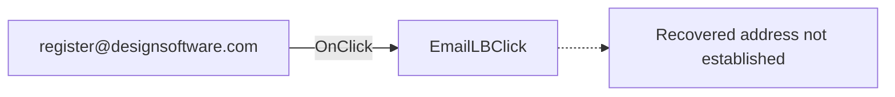

# register@designsoftware.com

> Analysis status: Pending individual source review.

## Control

| Property | Recovered value |
| --- | --- |
| Form | RegisterDlg |
| Component path | RegisterDlg.PageCtrl.ManualPg.EmailLB |
| Control class | TLabel |
| Caption | register@designsoftware.com |
| Hint | Send mail! |
| Text | Not present in the recovered resource. |
| Handler name | EmailLBClick |
| Handler address | Not present in the recovered resource. |
| Graph node | `resource:dfm:RegisterDlg/RegisterDlg.PageCtrl.ManualPg.EmailLB` |
| Handler node | `concept:dfm-handler:TRegisterDlg/EmailLBClick` |
| Graph layer | tina.exe |

## What happens when clicked

Pending individual analysis. An agent must read the recovered handler source and its relevant callees before it replaces this text.

## Click flow

## Handler evidence

- Source: [DecompiledSources/Tina16/resources/dfm/ui-evidence.json](../../../DecompiledSources/Tina16/resources/dfm/ui-evidence.json)
- Recovered role: Not present in the recovered resource.
- Current graph summary: Unresolved Delphi event handler TRegisterDlg.EmailLBClick, referenced by 1 UI event.
- Current graph behavior: Not present in the recovered resource.
- Current graph evidence: Not present in the recovered resource.
- Complexity: simple
- Distinct outgoing calls: Not present in the recovered resource.

## Direct calls

- No direct call edge is present in the recovered graph.

## Resource evidence

- Kind: Not present in the recovered resource.
- Modal result: Not present in the recovered resource.
- Checked state: Not present in the recovered resource.
- List items: Not present in the recovered resource.
- Image reference: Not present in the recovered resource.
- Extracted glyph: None.

## Nearby label candidates

Nearby labels are layout candidates only. They are not proof of behavior.

- Rank 1: register@designsoftware.com at distance 0.
- Rank 2: http://www.designsoftware.com at distance 44.
- Rank 3: and quote the Site Code shown above. at distance 74.

## Manual RTTI/VMT recovery result

The successful manual recovery pattern for `TdlgFlowchartInterruptAVRext0` was applied to this form. That class has a second class-name copy for RTTI, a qword from VMT offset `-0x88` to its length-prefixed class name, and a published-method-table pointer at VMT offset `-0x98`.

`TRegisterDlg` has a different result. The mapped runtime image, rebuilt executable, and complete process dump each contain only one exact ASCII `TRegisterDlg` string. In the mapped image, this string is at `038f1e8d`, after the length byte `0x0c`, inside the embedded `TPF0` form stream. No qword in the mapped image points to `038f1e8c` or `038f1e8d`. Thus, this copy is not an address-backed VMT class-name target.

`KillLicMnuClick`, `ExportLicMnuClick`, `ImportLicMnuClick`, `InitTrMediaMnuClick`, `EmailLBClick`, and `WebLBClick` also occur only in this form stream. `CancelBtnClick` and `OKBtnClick` occur for other classes, but no recovered `TRegisterDlg` VMT can assign any common-name entry to this form. All 14 recovered events on the class remain addressless in the graph.

Therefore, the available artifacts supply no `TRegisterDlg` VMT base, no VMT `-0x98` published-method-table pointer, and no method record that maps this handler name to executable code. An exact handler address cannot be assigned without another module, symbol map, or runtime capture that contains the missing class RTTI.

## Analysis limits

- Do not infer behavior from the control class, caption, hint, glyph, or nearby label alone.
- The UI extractor recovered the `EmailLBClick` name but no code address. Its concept node has one incoming UI trigger and no function source or call edge. All 14 recovered `TRegisterDlg` events have the same unresolved address gap. The address caption and `Send mail!` hint suggest user intent, but they do not establish the invoked API, message fields, or error behavior. Keep this article pending until a handler body or another proven state path is recovered.
