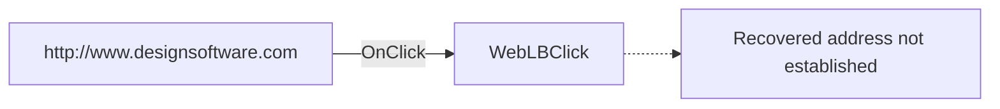

# http://www.designsoftware.com

> Analysis status: Pending individual source review.

## Control

| Property | Recovered value |
| --- | --- |
| Form | RegisterDlg |
| Component path | RegisterDlg.PageCtrl.ManualPg.WebLB |
| Control class | TLabel |
| Caption | http://www.designsoftware.com |
| Hint | Go to website! |
| Text | Not present in the recovered resource. |
| Handler name | WebLBClick |
| Handler address | Not present in the recovered resource. |
| Graph node | `resource:dfm:RegisterDlg/RegisterDlg.PageCtrl.ManualPg.WebLB` |
| Handler node | `concept:dfm-handler:TRegisterDlg/WebLBClick` |
| Graph layer | tina.exe |

## What happens when clicked

Pending individual analysis. An agent must read the recovered handler source and its relevant callees before it replaces this text.

## Click flow

## Handler evidence

- Source: [DecompiledSources/Tina16/resources/dfm/ui-evidence.json](../../../DecompiledSources/Tina16/resources/dfm/ui-evidence.json)
- Recovered role: Not present in the recovered resource.
- Current graph summary: Unresolved Delphi event handler TRegisterDlg.WebLBClick, referenced by 1 UI event.
- Current graph behavior: Not present in the recovered resource.
- Current graph evidence: Not present in the recovered resource.
- Complexity: simple
- Distinct outgoing calls: Not present in the recovered resource.

## Direct calls

- No direct call edge is present in the recovered graph.

## Resource evidence

- Kind: Not present in the recovered resource.
- Modal result: Not present in the recovered resource.
- Checked state: Not present in the recovered resource.
- List items: Not present in the recovered resource.
- Image reference: Not present in the recovered resource.
- Extracted glyph: None.

## Nearby label candidates

Nearby labels are layout candidates only. They are not proof of behavior.

- Rank 1: http://www.designsoftware.com at distance 0.
- Rank 2: register@designsoftware.com at distance 44.
- Rank 3: To obtain your Authorization Code please visit: at distance 86.

## Analysis limits

- Do not infer behavior from the control class, caption, hint, glyph, or nearby label alone.
- The UI extractor recovered the `WebLBClick` name but no code address. Its concept node has one incoming UI trigger and no function source or call edge. All 14 recovered `TRegisterDlg` events have the same unresolved address gap. The URL caption and `Go to website!` hint suggest user intent, but they do not establish the invoked API, final target, or error behavior. Keep this article pending until a handler body or another proven state path is recovered.
