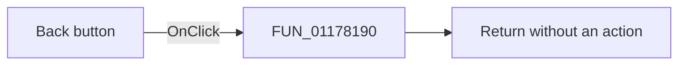

# &Back

> Analysis status: Source reviewed. The recovered handler is a no-op.

## Control

| Property | Recovered value |
| --- | --- |
| Form | Response_form1 |
| Component path | Response_form1.BackButton1 |
| Control class | TBitBtn |
| Caption | &Back |
| Handler name | BackButton1Click |
| Handler address | 01178190 |
| Graph node | `resource:dfm:Response_form1/Response_form1.BackButton1` |
| Handler node | `function:01178190` |
| Graph layer | UI |

## What happens when clicked

[FUN_01178190](../../../DecompiledSources/Tina16/functions/0000000001178190__FUN_01178190.c) returns immediately. It reads no input, changes no field, calls no function, and reports no error. The resource marks this control hidden. Its left-arrow glyph confirms the visible direction only; it does not supply a navigation implementation.

## Click flow

## Handler evidence

- Recovered role: No-op Back click handler.
- Direct calls: None.
- Resource state: `Visible = false`.
- Extracted glyph: [left arrow](../../../glyph/0318_Response_form1_Response_form1_BackButton1_Glyph_Data.png).

## Analysis limits

No recovered code implements a Back operation.

