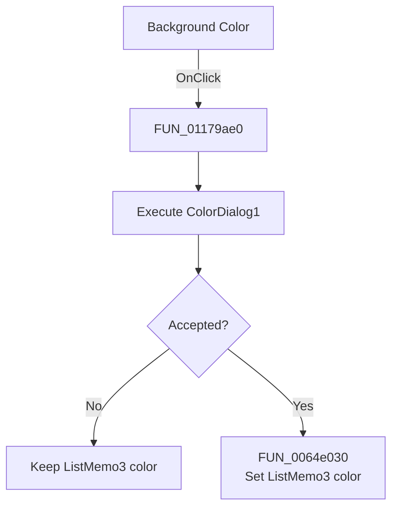

# Background Color

> Analysis status: Source reviewed. The handler changes `ListMemo3` background color after dialog acceptance.

## Control

| Property | Recovered value |
| --- | --- |
| Form | Response_form1 |
| Component path | Response_form1.PopupMenu6.BackColor6 |
| Control class | TMenuItem |
| Caption | Background Color |
| Handler name | BackColor6Click |
| Handler address | 01179ae0 |
| Graph node | `resource:dfm:Response_form1/Response_form1.PopupMenu6.BackColor6` |
| Handler node | `function:01179ae0` |
| Graph layer | UI |

## What happens when clicked

[FUN_01179ae0](../../../DecompiledSources/Tina16/functions/0000000001179AE0__FUN_01179ae0.c) executes `ColorDialog1`. If the user accepts, it passes the selected color to `FUN_0064e030` for `ListMemo3`. If the user cancels, it returns without changing the view.

The VCL setter changes the stored color only when it differs and then sends the color-change notification. The handler does not change the other five response views.

## Click flow

## Handler evidence

- Recovered role: Set `ListMemo3` background color from the accepted dialog.
- Target mapping: form field `+0x840` is `ListMemo3`; the paired view handlers and `FormCreate` confirm it.
- Direct call: `FUN_0064e030`, the VCL color setter.
- Resource dialog: `ColorDialog1`.
- Extracted glyph: None.

## Analysis limits

The selected color is user input and is unknown before the dialog runs.

