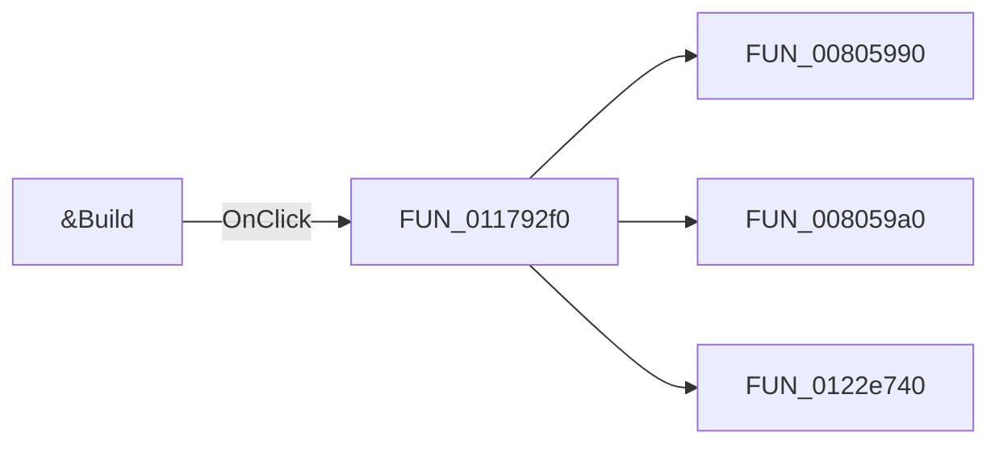

# &Build

> Analysis status: Pending individual source review.

## Control

| Property | Recovered value |
| --- | --- |
| Form | Response_form1 |
| Component path | Response_form1.SettingsGroupBox2.BuildBitBtn2 |
| Control class | TBitBtn |
| Caption | &Build |
| Hint | Not present in the recovered resource. |
| Text | Not present in the recovered resource. |
| Handler name | BuildBitBtn2Click |
| Handler address | 011792f0 |
| Graph node | `resource:dfm:Response_form1/Response_form1.SettingsGroupBox2.BuildBitBtn2` |
| Handler node | `function:011792f0` |
| Graph layer | UI |

## What happens when clicked

Pending individual analysis. An agent must read the recovered handler source and its relevant callees before it replaces this text.

## Click flow

## Handler evidence

- Source: [DecompiledSources/Tina16/functions/00000000011792F0__FUN_011792f0.c](../../../DecompiledSources/Tina16/functions/00000000011792F0__FUN_011792f0.c)
- Recovered role: Not present in the recovered resource.
- Current graph summary: Handles 1 Delphi UI event: Response_form1.SettingsGroupBox2.BuildBitBtn2.OnClick.
- Current graph behavior: Not present in the recovered resource.
- Current graph evidence: Not present in the recovered resource.
- Complexity: complex
- Distinct outgoing calls: 3

## Direct calls

- `function:00805990` — FUN_00805990
- `function:008059a0` — FUN_008059a0
- `function:0122e740` — Handles 1 Delphi UI event: Analog_form1.NEXTButton1.OnClick.

## Resource evidence

- Kind: Not present in the recovered resource.
- Modal result: Not present in the recovered resource.
- Checked state: Not present in the recovered resource.
- List items: Not present in the recovered resource.
- Image reference: Not present in the recovered resource.
- Extracted glyph: None.

## Nearby label candidates

Nearby labels are layout candidates only. They are not proof of behavior.

- Rank 1: Number of points at distance 96.
- Rank 2: Gain. min (dB) at distance 233.
- Rank 3: Stop freq.(Hz) at distance 257.

## Analysis limits

- Do not infer behavior from the control class, caption, hint, glyph, or nearby label alone.
- Do not replace the pending status until the handler source and relevant call path provide enough evidence.
