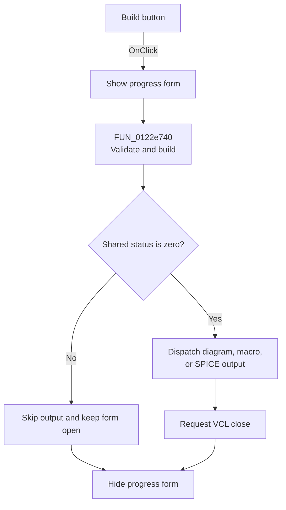

# &Build

> Analysis status: Source reviewed. The handler runs the shared status-gated filter build and output path.

## Control

| Property | Recovered value |
| --- | --- |
| Form | Response_form1 |
| Component path | Response_form1.SettingsGroupBox2.BuildBitBtn2 |
| Control class | TBitBtn |
| Caption | &Build |
| Handler name | BuildBitBtn2Click |
| Handler address | 011792f0 |
| Graph node | `resource:dfm:Response_form1/Response_form1.SettingsGroupBox2.BuildBitBtn2` |
| Handler node | `function:011792f0` |
| Graph layer | UI |

## What happens when clicked

[FUN_011792f0](../../../DecompiledSources/Tina16/functions/00000000011792F0__FUN_011792f0.c) shows a shared progress form, calls `FUN_0122e740`, and hides the progress form when the call returns.

The delegated routine synchronizes model text, validates the filter specification, calculates edge responses, and constructs an active or passive implementation for an Analog filter. A nonzero shared status stops later stages and leaves the design form open. With zero status, it dispatches the selected TINA schematic, TINA macro, or SPICE netlist output, then requests the normal VCL close path.

Canceling the SPICE file dialog performs no write, but the output helper does not convert this cancel into a build error.

## Click flow

## Handler evidence

- Recovered role: Run the shared final filter-build pipeline with progress visibility.
- Direct calls: `FUN_008059a0`, `FUN_0122e740`, and `FUN_00805990`.
- `FUN_0122e740` gates validation, calculation, construction, output, and close on the shared status.
- Extracted glyph: None.

## Analysis limits

This handler delegates to the shared Analog-form build routine; it does not implement a separate algorithm.

