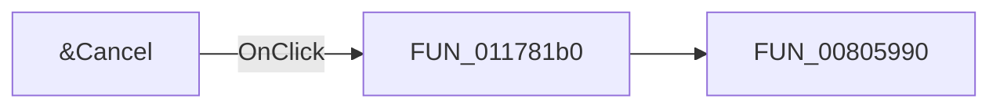

# &Cancel

> Analysis status: Pending individual source review.

## Control

| Property | Recovered value |
| --- | --- |
| Form | Response_form1 |
| Component path | Response_form1.CloseBitBtn1 |
| Control class | TBitBtn |
| Caption | &Cancel |
| Hint | Not present in the recovered resource. |
| Text | Not present in the recovered resource. |
| Handler name | CloseBitBtn1Click |
| Handler address | 011781b0 |
| Graph node | `resource:dfm:Response_form1/Response_form1.CloseBitBtn1` |
| Handler node | `function:011781b0` |
| Graph layer | UI |

## What happens when clicked

Pending individual analysis. An agent must read the recovered handler source and its relevant callees before it replaces this text.

## Click flow

## Handler evidence

- Source: [DecompiledSources/Tina16/functions/00000000011781B0__FUN_011781b0.c](../../../DecompiledSources/Tina16/functions/00000000011781B0__FUN_011781b0.c)
- Recovered role: Not present in the recovered resource.
- Current graph summary: Handles 1 Delphi UI event: Response_form1.CloseBitBtn1.OnClick.
- Current graph behavior: Not present in the recovered resource.
- Current graph evidence: Not present in the recovered resource.
- Complexity: simple
- Distinct outgoing calls: 1

## Direct calls

- `function:00805990` — FUN_00805990

## Resource evidence

- Kind: bkCancel
- Modal result: Not present in the recovered resource.
- Checked state: Not present in the recovered resource.
- List items: Not present in the recovered resource.
- Image reference: Not present in the recovered resource.
- Extracted glyph: None.

## Nearby label candidates

Nearby labels are layout candidates only. They are not proof of behavior.

- No same-parent label candidate is available.

## Analysis limits

- Do not infer behavior from the control class, caption, hint, glyph, or nearby label alone.
- Do not replace the pending status until the handler source and relevant call path provide enough evidence.
