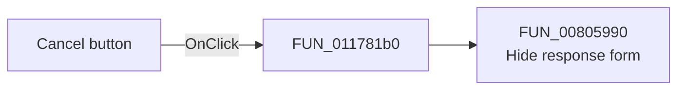

# &Cancel

> Analysis status: Source reviewed. The handler hides the response form.

## Control

| Property | Recovered value |
| --- | --- |
| Form | Response_form1 |
| Component path | Response_form1.CloseBitBtn1 |
| Control class | TBitBtn |
| Caption | &Cancel |
| Handler name | CloseBitBtn1Click |
| Handler address | 011781b0 |
| Graph node | `resource:dfm:Response_form1/Response_form1.CloseBitBtn1` |
| Handler node | `function:011781b0` |
| Graph layer | UI |

## What happens when clicked

[FUN_011781b0](../../../DecompiledSources/Tina16/functions/00000000011781B0__FUN_011781b0.c) calls `FUN_00805990` for the global response-form instance. This VCL helper clears the form's visible state. Repeating the operation is a no-op after the form is hidden. The resource also sets `Kind = bkCancel`; the direct recovered effect is Hide.

## Click flow

## Handler evidence

- Recovered role: Hide the response form from its Cancel button.
- Direct call: `FUN_00805990`, the recovered VCL form-hide helper.
- Resource kind: `bkCancel`.
- Extracted glyph: None.

## Analysis limits

The handler does not free the form or clear response data. The form's recovered `OnClose` handler is also a no-op.

