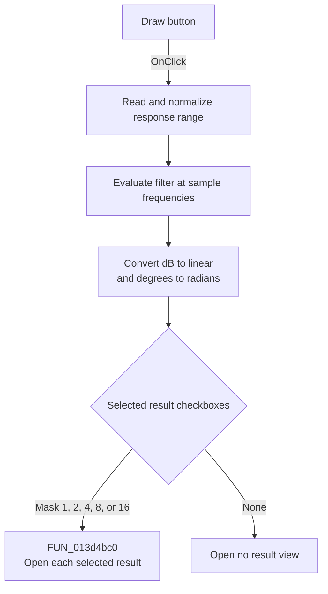

# &Draw

> Analysis status: Source reviewed. The handler calculates sampled response data and opens the selected result views.

## Control

| Property | Recovered value |
| --- | --- |
| Form | Response_form1 |
| Component path | Response_form1.SettingsGroupBox2.DrawBitBtn1 |
| Control class | TBitBtn |
| Caption | &Draw |
| Handler name | DrawBitBtn1Click |
| Handler address | 01178490 |
| Graph node | `resource:dfm:Response_form1/Response_form1.SettingsGroupBox2.DrawBitBtn1` |
| Handler node | `function:01178490` |
| Graph layer | UI |

## What happens when clicked

[FUN_01178490](../../../DecompiledSources/Tina16/functions/0000000001178490__FUN_01178490.c) reads the response start, stop, gain-scale, and point-count controls. `FUN_011762d0` requires start below stop. For an invalid interval, it shows an error and changes stop to start times 100. The click handler does not stop on that return value; it continues with the adjusted range.

It builds linear or logarithmic sample frequencies, evaluates the current Analog, FIR, or IIR filter, publishes magnitude and phase arrays, and replaces the previous response object. It converts magnitude from decibels with `10^(dB/20)` and phase from degrees to radians before it adds each point.

It then reads the five checkboxes: Amplitude uses mask 1, Phase 2, Amplitude and Phase 4, Nyquist 8, and Group delay 16. `FUN_013d4bc0` opens each selected result. If none are checked, the response data is created but no result view opens.

## Click flow

## Handler evidence

- Recovered role: Calculate sampled filter-response data and open selected result views.
- Key direct calls: `FUN_011762d0`, `FUN_0115f5b0`, `FUN_0115f9c0`, `FUN_011770f0`, and `FUN_013d4bc0`.
- Resource inputs: Start frequency, Stop frequency, Gain minimum, Number of points, and five result checkboxes.
- Extracted glyph: None.

## Analysis limits

Several result-object helper names are unrecovered. Their data roles are supported by their arguments and by `FUN_013d4bc0`.

