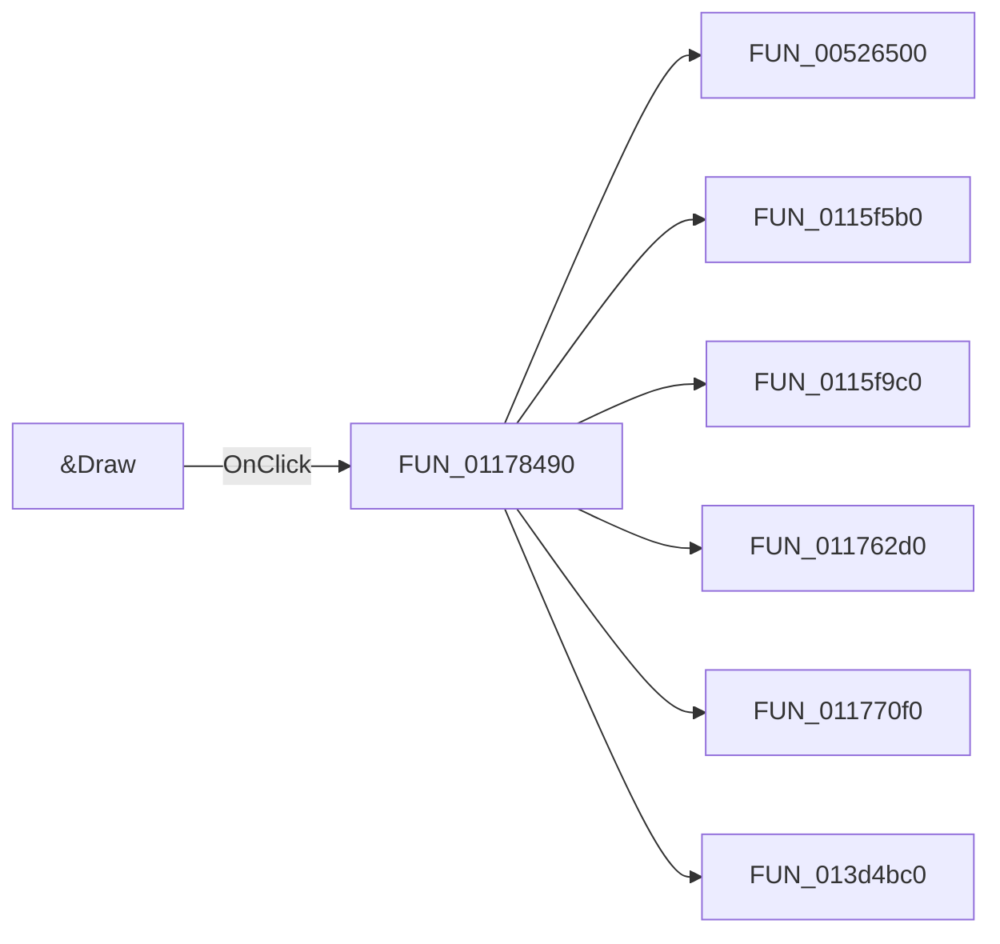

# &Draw

> Analysis status: Pending individual source review.

## Control

| Property | Recovered value |
| --- | --- |
| Form | Response_form1 |
| Component path | Response_form1.SettingsGroupBox2.DrawBitBtn1 |
| Control class | TBitBtn |
| Caption | &Draw |
| Hint | Not present in the recovered resource. |
| Text | Not present in the recovered resource. |
| Handler name | DrawBitBtn1Click |
| Handler address | 01178490 |
| Graph node | `resource:dfm:Response_form1/Response_form1.SettingsGroupBox2.DrawBitBtn1` |
| Handler node | `function:01178490` |
| Graph layer | UI |

## What happens when clicked

Pending individual analysis. An agent must read the recovered handler source and its relevant callees before it replaces this text.

## Click flow

## Handler evidence

- Source: [DecompiledSources/Tina16/functions/0000000001178490__FUN_01178490.c](../../../DecompiledSources/Tina16/functions/0000000001178490__FUN_01178490.c)
- Recovered role: Not present in the recovered resource.
- Current graph summary: Handles 1 Delphi UI event: Response_form1.SettingsGroupBox2.DrawBitBtn1.OnClick.
- Current graph behavior: Not present in the recovered resource.
- Current graph evidence: Not present in the recovered resource.
- Complexity: complex
- Distinct outgoing calls: 14

## Direct calls

- `function:00526500` — FUN_00526500
- `function:0115f5b0` — FUN_0115f5b0
- `function:0115f9c0` — FUN_0115f9c0
- `function:011762d0` — FUN_011762d0
- `function:011770f0` — FUN_011770f0
- `function:013d4bc0` — FUN_013d4bc0
- `function:01c8a3c0` — FUN_01c8a3c0
- `function:01cc2930` — FUN_01cc2930
- `function:01cc31d0` — FUN_01cc31d0
- `function:01cc3760` — FUN_01cc3760
- `function:01cc3870` — FUN_01cc3870
- `function:01cc47e0` — FUN_01cc47e0
- `function:01cc48a0` — FUN_01cc48a0
- `function:01cc6060` — FUN_01cc6060

## Resource evidence

- Kind: Not present in the recovered resource.
- Modal result: Not present in the recovered resource.
- Checked state: Not present in the recovered resource.
- List items: Not present in the recovered resource.
- Image reference: Not present in the recovered resource.
- Extracted glyph: None.

## Nearby label candidates

Nearby labels are layout candidates only. They are not proof of behavior.

- Rank 1: Number of points at distance 24.
- Rank 2: Gain. min (dB) at distance 161.
- Rank 3: Stop freq.(Hz) at distance 185.

## Analysis limits

- Do not infer behavior from the control class, caption, hint, glyph, or nearby label alone.
- Do not replace the pending status until the handler source and relevant call path provide enough evidence.
