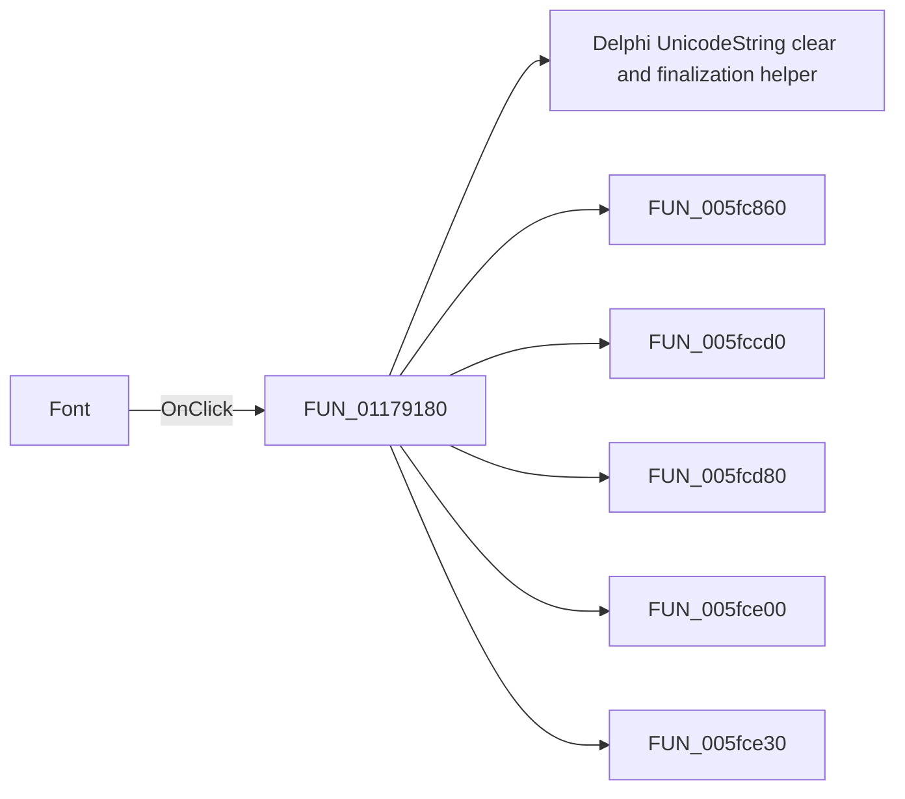

# Font

> Analysis status: Pending individual source review.

## Control

| Property | Recovered value |
| --- | --- |
| Form | Response_form1 |
| Component path | Response_form1.PopupMenu3.FontType3 |
| Control class | TMenuItem |
| Caption | Font |
| Hint | Not present in the recovered resource. |
| Text | Not present in the recovered resource. |
| Handler name | FontType3Click |
| Handler address | 01179180 |
| Graph node | `resource:dfm:Response_form1/Response_form1.PopupMenu3.FontType3` |
| Handler node | `function:01179180` |
| Graph layer | UI |

## What happens when clicked

Pending individual analysis. An agent must read the recovered handler source and its relevant callees before it replaces this text.

## Click flow

## Handler evidence

- Source: [DecompiledSources/Tina16/functions/0000000001179180__FUN_01179180.c](../../../DecompiledSources/Tina16/functions/0000000001179180__FUN_01179180.c)
- Recovered role: Not present in the recovered resource.
- Current graph summary: Handles 1 Delphi UI event: Response_form1.PopupMenu3.FontType3.OnClick.
- Current graph behavior: Not present in the recovered resource.
- Current graph evidence: Not present in the recovered resource.
- Complexity: complex
- Distinct outgoing calls: 8

## Direct calls

- `function:00414480` — Delphi UnicodeString clear and finalization helper
- `function:005fc860` — FUN_005fc860
- `function:005fccd0` — FUN_005fccd0
- `function:005fcd80` — FUN_005fcd80
- `function:005fce00` — FUN_005fce00
- `function:005fce30` — FUN_005fce30
- `function:005fce60` — FUN_005fce60
- `function:005fce70` — FUN_005fce70

## Resource evidence

- Kind: Not present in the recovered resource.
- Modal result: Not present in the recovered resource.
- Checked state: Not present in the recovered resource.
- List items: Not present in the recovered resource.
- Image reference: Not present in the recovered resource.
- Extracted glyph: None.

## Nearby label candidates

Nearby labels are layout candidates only. They are not proof of behavior.

- No same-parent label candidate is available.

## Analysis limits

- Do not infer behavior from the control class, caption, hint, glyph, or nearby label alone.
- Do not replace the pending status until the handler source and relevant call path provide enough evidence.
