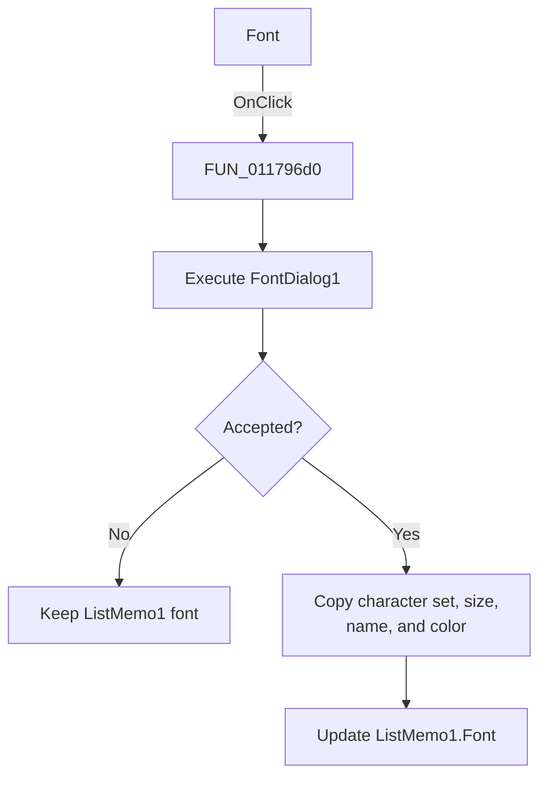

# Font

> Analysis status: Source reviewed. The handler copies accepted font settings to `ListMemo1`.

## Control

| Property | Recovered value |
| --- | --- |
| Form | Response_form1 |
| Component path | Response_form1.PopupMenu4.Fonttype4 |
| Control class | TMenuItem |
| Caption | Font |
| Handler name | Fonttype4Click |
| Handler address | 011796d0 |
| Graph node | `resource:dfm:Response_form1/Response_form1.PopupMenu4.Fonttype4` |
| Handler node | `function:011796d0` |
| Graph layer | UI |

## What happens when clicked

[FUN_011796d0](../../../DecompiledSources/Tina16/functions/00000000011796D0__FUN_011796d0.c) executes `FontDialog1`. Canceling leaves `ListMemo1` unchanged. After acceptance, the handler copies the dialog font's character set, size or height setting, name, and color to `ListMemo1.Font`. The VCL setters notify the target when a copied value differs.

This is a property-by-property copy. It does not change another response view.

## Click flow

## Handler evidence

- Recovered role: Apply accepted font properties to `ListMemo1`.
- Target mapping: form field `+0x848` is `ListMemo1`; paired view handlers confirm it.
- Direct helpers: `FUN_005fce60/70`, `FUN_005fce00/30`, `FUN_005fccd0`, `FUN_005fcd80`, and `FUN_005fc860`.
- Resource dialog: `FontDialog1`.
- Extracted glyph: None.

## Analysis limits

The recovered copy does not prove that every possible Delphi `TFont` property is transferred.

