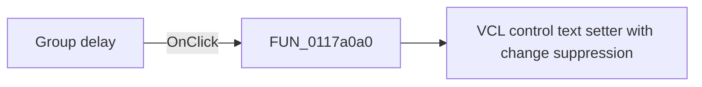

# Group delay

> Analysis status: Pending individual source review.

## Control

| Property | Recovered value |
| --- | --- |
| Form | Response_form1 |
| Component path | Response_form1.SettingsGroupBox2.GroupCheckBox1 |
| Control class | TCheckBox |
| Caption | Group delay |
| Hint | Not present in the recovered resource. |
| Text | Not present in the recovered resource. |
| Handler name | GroupCheckBox1Click |
| Handler address | 0117a0a0 |
| Graph node | `resource:dfm:Response_form1/Response_form1.SettingsGroupBox2.GroupCheckBox1` |
| Handler node | `function:0117a0a0` |
| Graph layer | UI |

## What happens when clicked

Pending individual analysis. An agent must read the recovered handler source and its relevant callees before it replaces this text.

## Click flow

## Handler evidence

- Source: [DecompiledSources/Tina16/functions/000000000117A0A0__FUN_0117a0a0.c](../../../DecompiledSources/Tina16/functions/000000000117A0A0__FUN_0117a0a0.c)
- Recovered role: Not present in the recovered resource.
- Current graph summary: Handles 1 Delphi UI event: Response_form1.SettingsGroupBox2.GroupCheckBox1.OnClick.
- Current graph behavior: Not present in the recovered resource.
- Current graph evidence: Not present in the recovered resource.
- Complexity: simple
- Distinct outgoing calls: 1

## Direct calls

- `function:0064de00` — VCL control text setter with change suppression

## Resource evidence

- Kind: Not present in the recovered resource.
- Modal result: Not present in the recovered resource.
- Checked state: Not present in the recovered resource.
- List items: Not present in the recovered resource.
- Image reference: Not present in the recovered resource.
- Extracted glyph: None.

## Nearby label candidates

Nearby labels are layout candidates only. They are not proof of behavior.

- Rank 1: Number of points at distance 48.
- Rank 2: Gain. min (dB) at distance 89.
- Rank 3: Stop freq.(Hz) at distance 113.

## Analysis limits

- Do not infer behavior from the control class, caption, hint, glyph, or nearby label alone.
- Do not replace the pending status until the handler source and relevant call path provide enough evidence.
