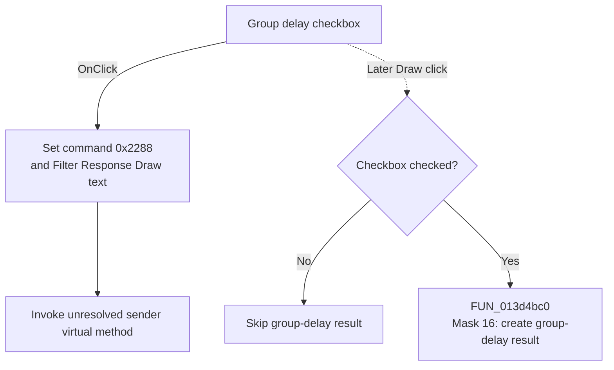

# Group delay

> Analysis status: Source reviewed. The handler publishes response-draw context; Draw later reads this checkbox.

## Control

| Property | Recovered value |
| --- | --- |
| Form | Response_form1 |
| Component path | Response_form1.SettingsGroupBox2.GroupCheckBox1 |
| Control class | TCheckBox |
| Caption | Group delay |
| Handler name | GroupCheckBox1Click |
| Handler address | 0117a0a0 |
| Graph node | `resource:dfm:Response_form1/Response_form1.SettingsGroupBox2.GroupCheckBox1` |
| Handler node | `function:0117a0a0` |
| Graph layer | UI |

## What happens when clicked

[FUN_0117a0a0](../../../DecompiledSources/Tina16/functions/000000000117A0A0__FUN_0117a0a0.c) stores command identifier `0x2288`, sets shared control text to `Filter Response Draw`, and invokes a virtual method on the checkbox that sent the event. The exact Delphi name of that virtual method is not recovered.

The handler does not read the checked state, enforce exclusive selection, calculate a response, or open a result. Standard checkbox processing changes the state before `OnClick` runs.

Later, [FUN_01178490](../../../DecompiledSources/Tina16/functions/0000000001178490__FUN_01178490.c) reads this checkbox. When checked, Draw passes mask `16` to `FUN_013d4bc0`, which creates the group-delay result. When clear, Draw skips that result.

## Click flow

## Handler evidence

- Recovered role: Publish response-draw context after the checkbox changes.
- Direct call: `FUN_0064de00`, the VCL control-text setter.
- Later consumer: `FUN_01178490` maps this checkbox to mask `16`.
- Initial checked state: not set in the resource.
- Extracted glyph: None.

## Analysis limits

VMT slot `0x188` is unresolved, so this article does not name its exact effect.

