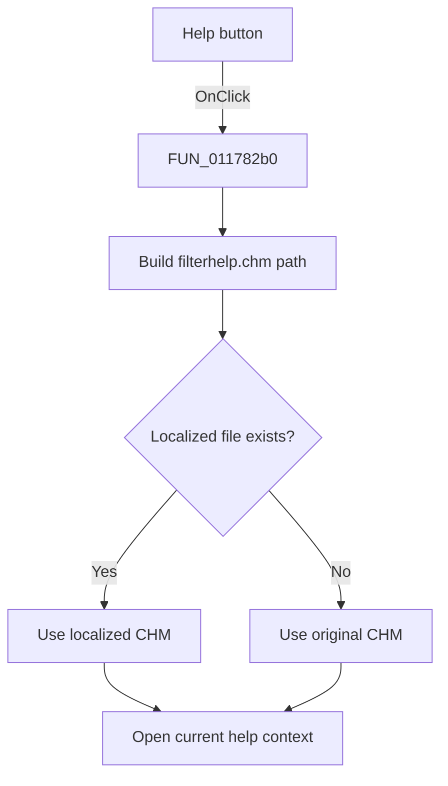

# &Help

> Analysis status: Source reviewed. The handler opens filter help for the current help context.

## Control

| Property | Recovered value |
| --- | --- |
| Form | Response_form1 |
| Component path | Response_form1.HelpBitBtn1 |
| Control class | TBitBtn |
| Caption | &Help |
| Handler name | HelpBitBtn1Click |
| Handler address | 011782b0 |
| Graph node | `resource:dfm:Response_form1/Response_form1.HelpBitBtn1` |
| Handler node | `function:011782b0` |
| Graph layer | UI |

## What happens when clicked

[FUN_011782b0](../../../DecompiledSources/Tina16/functions/00000000011782B0__FUN_011782b0.c) builds a path for `filterhelp.chm` and calls `FUN_01b1def0`. The helper selects an existing language-specific file, or falls back to the original file. The handler passes that path and the current global help context to the application help service. It has no local error-message branch.

## Click flow

## Handler evidence

- Recovered role: Open localized filter help for the current context.
- Key direct call: `FUN_01b1def0`, the localized-help resolver.
- Extracted glyph: [question mark](../../../glyph/0317_Response_form1_Response_form1_HelpBitBtn1_Glyph_Data.png).

## Analysis limits

The numeric help context comes from global state. Its topic title is not recovered here.

