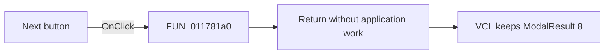

# &Next

> Analysis status: Source reviewed. The handler is a no-op; the button keeps its VCL modal-result property.

## Control

| Property | Recovered value |
| --- | --- |
| Form | Response_form1 |
| Component path | Response_form1.NEXTButton1 |
| Control class | TBitBtn |
| Caption | &Next |
| Handler name | NEXTButton1Click |
| Handler address | 011781a0 |
| Graph node | `resource:dfm:Response_form1/Response_form1.NEXTButton1` |
| Handler node | `function:011781a0` |
| Graph layer | UI |

## What happens when clicked

[FUN_011781a0](../../../DecompiledSources/Tina16/functions/00000000011781A0__FUN_011781a0.c) returns immediately. It does not validate data, call another form, or change application state. The resource sets `ModalResult = 8`, which standard VCL button processing can apply after the event returns. The resource also marks the control hidden.

## Click flow

## Handler evidence

- Recovered role: No-op Next click handler.
- Direct calls: None.
- Resource state: `Visible = false`; `ModalResult = 8`.
- Extracted glyph: [right arrow](../../../glyph/0319_Response_form1_Response_form1_NEXTButton1_Glyph_Data.png).

## Analysis limits

The right-arrow glyph and caption do not prove a separate navigation path.

