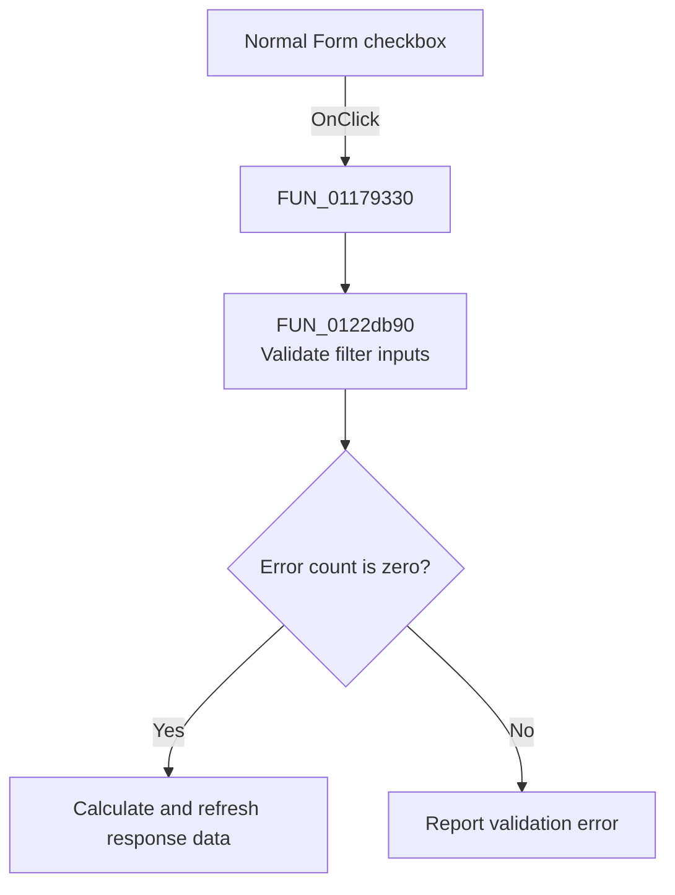

# Normal Form

> Analysis status: Source reviewed. The handler requests filter validation and response refresh.

## Control

| Property | Recovered value |
| --- | --- |
| Form | Response_form1 |
| Component path | Response_form1.NormalformCheckBox1 |
| Control class | TCheckBox |
| Caption | Normal Form |
| Handler name | NormalformCheckBox1Click |
| Handler address | 01179330 |
| Graph node | `resource:dfm:Response_form1/Response_form1.NormalformCheckBox1` |
| Handler node | `function:01179330` |
| Graph layer | UI |

## What happens when clicked

[FUN_01179330](../../../DecompiledSources/Tina16/functions/0000000001179330__FUN_01179330.c) calls `FUN_0122db90` for the shared filter-design form with refresh flag `1`. The callee reads and validates the selected filter-mode inputs. Valid input updates the shared filter record and refreshes response data. Invalid input increments the shared error count and can show `Wstop-Wpass ERROR`.

The handler does not read this checkbox's state. Checking and clearing it invoke the same path. The resource marks this control hidden.

## Click flow

## Handler evidence

- Recovered role: Request shared filter validation and response refresh.
- Direct call: `FUN_0122db90`.
- Resource state: `Visible = false`.
- Extracted glyph: None.

## Analysis limits

No recovered branch assigns distinct behavior from the checkbox value.

