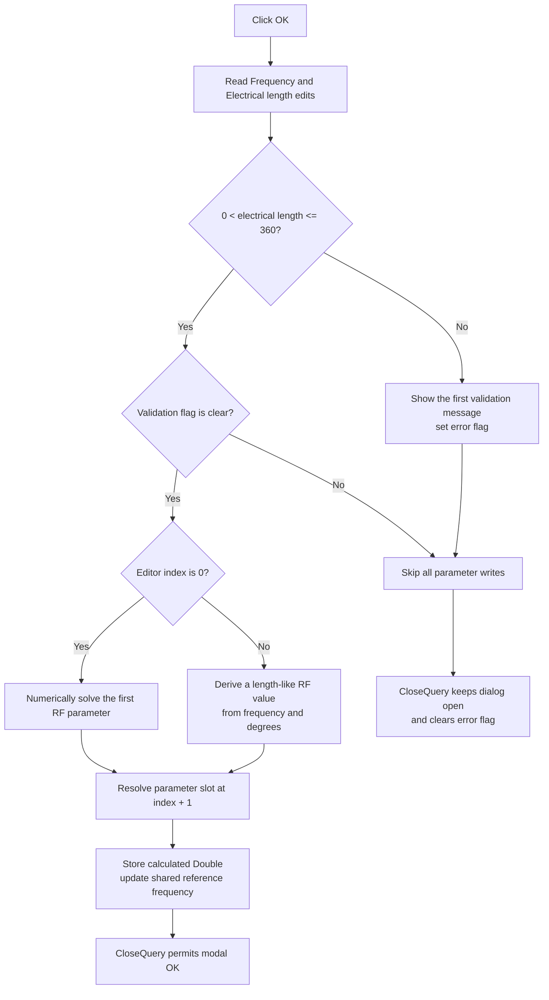

# Validate electrical length and store the derived RF parameter

> Analysis status: Reviewed from the recovered click handler, paired form initialization, RF calculation helpers, typed parameter-slot accessor, validation reporter, close-query handler, form resource, and caller.

## Control

| Property | Recovered value |
| --- | --- |
| Form | RfrEditorDlg |
| Form caption | Parameter Editor |
| Component path | RfrEditorDlg.OKBtn |
| Control class | TBitBtn |
| Button kind | bkOK |
| Handler name | OKBtnClick |
| Handler address | 01429360 |
| Graph node | `resource:dfm:RfrEditorDlg/RfrEditorDlg.OKBtn` |
| Handler node | `function:01429360` |
| Graph layer | UI |

## What happens when clicked

`TRfrEditorDlg.OKBtnClick` reads `FloatEdit1`, labeled **Frequency [Hz]**, and `FloatEdit2`, labeled **Electrical length [deg]**. The electrical length must be greater than zero and no greater than 360 degrees.

If the electrical length is invalid, the handler loads localized string `0x134` and calls the form's shared validation reporter. The reporter shows the first active error and sets form error flag `+0x728`. The handler does not calculate or write a parameter while that flag is set.

When validation succeeds, the handler selects one of two recovered calculation paths from the editor index at `+0x6f8`:

- **Index 0:** calls `FUN_01428600`, which numerically solves the first RF parameter from four cached parameter values and the requested electrical length. This form mode disables the frequency edit during initialization.
- **Other index:** calls `FUN_014281e0` with the four cached parameter values, frequency, and electrical length. This helper derives a length-like RF value with the recovered relation `((degrees / 360) * 300000000) / (frequency * sqrt(effective relative permittivity))`.

The handler asks `FUN_01cfde70` for writable storage at one-based parameter position `editor index + 1` and stores the calculated `Double` there. It then reads the Frequency edit again and saves it in shared reference-frequency value `DAT_01f49758`.

The button's `bkOK` kind supplies the normal modal OK action. `TRfrEditorDlg.FormCloseQuery` permits the dialog to close only when error flag `+0x728` is zero, then clears the flag for the next attempt.

## Click flow

## Handler and calculation evidence

- [FUN_01429360](../../../DecompiledSources/Tina16/functions/0000000001429360__FUN_01429360.c) reads both edits, applies the degree limit, selects the calculation path, writes the indexed parameter slot, and updates the shared frequency.
- [FUN_01429170](../../../DecompiledSources/Tina16/functions/0000000001429170__FUN_01429170.c) is the paired form initializer. It loads parameter positions 1 through 4, fills the Frequency edit from `DAT_01f49758`, disables that edit for index `0`, and calculates the initial Electrical length value.
- [FUN_014281e0](../../../DecompiledSources/Tina16/functions/00000000014281E0__FUN_014281e0.c) implements the recovered frequency-and-degree conversion for a nonzero editor index.
- [FUN_01427ad0](../../../DecompiledSources/Tina16/functions/0000000001427AD0__FUN_01427ad0.c) derives the ratio terms and effective relative permittivity used by that conversion.
- [FUN_01428600](../../../DecompiledSources/Tina16/functions/0000000001428600__FUN_01428600.c) iterates until `FUN_01428550` accepts convergence for the index-zero solution.
- [FUN_01428550](../../../DecompiledSources/Tina16/functions/0000000001428550__FUN_01428550.c) accepts a near-zero absolute difference below `1e-20` or a relative difference below `0.001` percent.
- [FUN_01cfde70](../../../DecompiledSources/Tina16/functions/0000000001CFDE70__FUN_01cfde70.c) resolves the writable parameter address for the requested position and storage type.
- [FUN_01429040](../../../DecompiledSources/Tina16/functions/0000000001429040__FUN_01429040.c) forwards a message and the form error flag to the shared first-error reporter.
- [FUN_01b1cf30](../../../DecompiledSources/Tina16/functions/0000000001B1CF30__FUN_01b1cf30.c) shows the message only when the flag is clear and then sets the flag.
- [FUN_01429530](../../../DecompiledSources/Tina16/functions/0000000001429530__FUN_01429530.c) returns the inverse of that flag as `CanClose` and clears it afterward.
- [FUN_01435f20](../../../DecompiledSources/Tina16/functions/0000000001435F20__FUN_01435f20.c) constructs this dialog with the parameter container and editor index used by the handler.

## Resource evidence

- The form caption is `Parameter Editor`.
- `Label1` is `Frequency [Hz]` and is paired with `FloatEdit1` by form layout and handler field mapping.
- `Label2` is `Electrical length [deg]` and is paired with `FloatEdit2` by form layout and handler field mapping.
- `OKBtn` has `Kind = bkOK`. It has no separate caption, hint, image reference, or extracted glyph.

## State, error, and no-op behavior

- An electrical length at or below zero, or above 360, sets the error flag and causes no parameter or shared-frequency write.
- The numeric edit getters also have exception paths for invalid text, configured-range failure, and failed validation callbacks. Both edits bind their `OnError` event to the same form reporter. The click handler has no local catch.
- The first-error reporter suppresses later messages while its flag remains set.
- The typed parameter accessor's status outputs are ignored. The handler assumes the returned pointer is writable.
- The parameter value is written before the shared frequency is read a second time. The handler has no rollback if that later read fails.
- The handler calculates and stores one parameter only. It does not start a simulation.

## Analysis limits

- The recovered parameter container and editor-index field have no Delphi names. The article therefore describes the target as the indexed RF parameter and does not invent a component parameter name.
- Localized string `0x134` is not recovered as plain text here. Its call site proves that it reports the invalid electrical-length range.
- The exact Delphi constant names for the calculation modes are not recovered.
