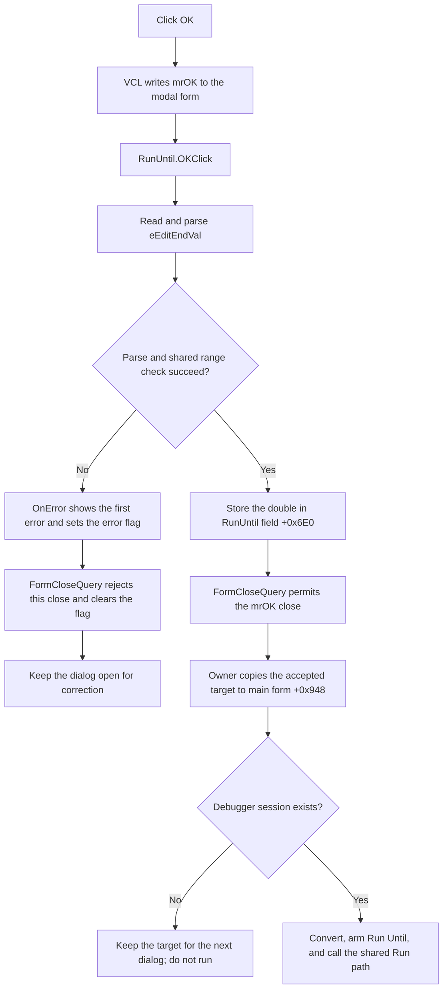

# Accept the Run Until target

> Analysis status: Evidence-backed source review complete.

## Control

| Property | Recovered value |
| --- | --- |
| Form | RunUntil |
| Component path | RunUntil.OK |
| Control class | TBitBtn |
| Caption | Supplied by the built-in `bkOK` kind; no explicit caption is present. |
| Hint | Not present in the recovered resource. |
| Text | Not present in the recovered resource. |
| Handler name | OKClick |
| Handler address | 01027600 |
| Graph node | `resource:dfm:RunUntil/RunUntil.OK` |
| Handler node | `function:01027600` |
| Graph layer | UI |

## What happens when clicked

The button has the built-in `bkOK` kind. The recovered VCL path gives this kind modal result `1`, the Delphi `mrOK` value. It writes that result to the parent form before it dispatches `OKClick`.

`FUN_01027600` ignores `Sender`. It reads the value from the `TFloatEdit` at form offset `+0x6B8` through `FUN_00b90090`. The shared getter reads and parses the editor text, rejects a value below `-1e50` or above `1e50`, updates the editor's cached double, and returns it. `OKClick` then stores that returned double in the RunUntil dialog field at `+0x6E0`.

The handler does not convert the value to the MCU time base, start the debugger, or run the flowchart. After the modal dialog returns `mrOK`, owner `FUN_0104f440` reads `+0x6E0`, stores it as the main form's current Run Until target at `+0x948`, and then performs the later conversion and execution checks. The dialog label does not show a unit. The recovered OK path has no explicit positive-value or current-time check. Therefore, zero and negative parsed values can leave this handler.

## Validation and close behavior

The float editor binds `OnError` to `FUN_01027510`. That event forwards the editor's error text to `FUN_01027580`, which uses the shared error helper to show only the first error and set form byte `+0x6D8` to `1`.

The form binds `OnCloseQuery` to `FUN_01027530`. This close query permits closure only when byte `+0x6D8` is clear. It then clears the byte for the next attempt. A reported editor error therefore blocks the current `bkOK` close attempt and lets the user correct the text. If the value getter does not return, `OKClick` does not overwrite dialog field `+0x6E0`.

There is no success message, alternate commit branch, or local exception handler in `OKClick`. The shared value getter can call an optional numeric-validation callback, but the RunUntil resource does not bind such an event. The recovered dialog code adds no other numeric restriction.

## Click flow

## Handler and related evidence

- [OKClick](../../../DecompiledSources/Tina16/functions/0000000001027600__FUN_01027600.c) contains only the float-value getter call and the write to form offset `+0x6E0`.
- [TFloatEdit value getter](../../../DecompiledSources/Tina16/functions/0000000000B90090__FUN_00b90090.c) reads the text, parses the double, applies the shared range and optional-callback checks, updates editor offset `+0x4D8`, and returns the value.
- [Float parser](../../../DecompiledSources/Tina16/functions/0000000000B8F030__FUN_00b8f030.c) supports the recovered engineering-number suffix table before it returns a double.
- [Editor OnError](../../../DecompiledSources/Tina16/functions/0000000001027510__FUN_01027510.c), [dialog error wrapper](../../../DecompiledSources/Tina16/functions/0000000001027580__FUN_01027580.c), and [first-error helper](../../../DecompiledSources/Tina16/functions/0000000001B1CF30__FUN_01b1cf30.c) supply the message and error-flag path.
- [FormCloseQuery](../../../DecompiledSources/Tina16/functions/0000000001027530__FUN_01027530.c) returns the inverse of error byte `+0x6D8` and then clears that byte.
- [FormCreate](../../../DecompiledSources/Tina16/functions/0000000001027550__FUN_01027550.c) initializes the error byte to zero. [FormShow](../../../DecompiledSources/Tina16/functions/0000000001027560__FUN_01027560.c) copies the current dialog value into the editor.
- [Run Until owner](../../../DecompiledSources/Tina16/functions/000000000104F440__FUN_0104f440.c) opens the dialog modally, consumes `+0x6E0` only after result `1`, and owns the later main-form, MCU, and Run changes.
- [VCL `TBitBtn` click](../../../DecompiledSources/Tina16/functions/000000000082B0E0__FUN_0082b0e0.c), [button click dispatch](../../../DecompiledSources/Tina16/functions/0000000000687F30__FUN_00687f30.c), and [button-kind setup](../../../DecompiledSources/Tina16/functions/000000000082BC30__FUN_0082bc30.c) establish the standard `bkOK` modal-result path.

## Resource evidence

- Kind: `bkOK`.
- Modal result: Not present as an explicit DFM property. The recovered built-in kind supplies `mrOK`.
- Nearby label: `Run Until:` at coordinate distance 52.
- The input is `RunUntil.eEditEndVal`, class `TFloatEdit`, with `OnError = eEditEndValError`.
- The form is centered, opens modally in the recovered owner, and has `OnCreate`, `OnShow`, and `OnCloseQuery` handlers.
- Image reference: Not present.
- Extracted glyph: None. `NumGlyphs = 2` refers to built-in `TBitBtn` imagery; no glyph bytes are stored in this resource.

## Evidence limits

- The handler commits a dialog value. It does not itself prove a displayed unit. The owner later multiplies the accepted value by `10^15` for the engine time base.
- The optional validation-callback branch in the shared float getter is generic framework behavior. No RunUntil-specific callback is recovered in the DFM.
- The source does not prove how the external MCU library handles a target that is zero, negative, or earlier than the current simulation time.
- Cancel is a separate built-in button. It does not execute this handler, and the owner leaves its prior target unchanged when the modal result is not `mrOK`.
