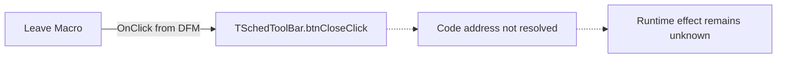

# Leave Macro

> Analysis status: Unresolved after individual resource, graph, and recovered-source review.

## Control

| Property | Recovered value |
| --- | --- |
| Form | SchedToolBar |
| Component path | SchedToolBar.btnClose |
| Control class | TButton |
| Caption | Leave Macro |
| Hint | Not present in the recovered resource. |
| Text | Not present in the recovered resource. |
| Handler name | btnCloseClick |
| Handler address | Not present in the recovered resource. |
| Graph node | `resource:dfm:SchedToolBar/SchedToolBar.btnClose` |
| Handler node | `concept:dfm-handler:TSchedToolBar/btnCloseClick` |
| Graph layer | tina.exe |

## What happens when clicked

The recovered DFM proves that a click dispatches `TSchedToolBar.btnCloseClick`. The
RTTI evidence preserves the method name, but it does not resolve a code address in
the recovered function range. The graph therefore has no handler function, source
file, direct calls, or field accesses that can establish the runtime effect.

The caption suggests that the control leaves a macro, but the available evidence
does not establish whether the handler closes or hides the toolbar, changes the
active macro, saves data, or asks for confirmation. The resource has no action,
modal result, button kind, default or cancel state, hint, or glyph that supplies
more evidence. Inputs, decisions, state changes, outputs, error handling, and
no-op behavior remain unknown.

## Click flow

## Handler evidence

- Source: [DecompiledSources/Tina16/resources/dfm/ui-evidence.json](../../../DecompiledSources/Tina16/resources/dfm/ui-evidence.json)
- Recovered role: Not present in the recovered resource.
- Current graph summary: Unresolved Delphi event handler TSchedToolBar.btnCloseClick, referenced by 1 UI event.
- Current graph behavior: Not available because the handler is not resolved to a function.
- Current graph evidence: DFM event binding and Delphi RTTI method name only.
- Complexity: simple
- Distinct outgoing calls: Not present in the recovered resource.

## Direct calls

- No direct call edge is present in the recovered graph.

## Resource evidence

- Kind: Not present in the recovered resource.
- Modal result: Not present in the recovered resource.
- Checked state: Not present in the recovered resource.
- List items: Not present in the recovered resource.
- Image reference: Not present in the recovered resource.
- Extracted glyph: None.

## Nearby label candidates

Nearby labels are layout candidates only. They are not proof of behavior.

- No same-parent label candidate is available.

## Analysis limits

- A repository-wide search of the recovered sources and analysis text found no
  `TSchedToolBar`, `SchedToolBar`, `btnCloseClick`, or `Leave Macro` match outside
  the extracted UI-resource documentation.
- The form's `OnShow` handler is also unresolved, so it cannot supply a verified
  lifecycle or shared-state path for this control.
- The caption alone does not prove a close, hide, save, prompt, or macro-state
  operation.
- A code address or an independently verified runtime trace is required before
  this control can receive a function annotation or a specific behavior claim.
