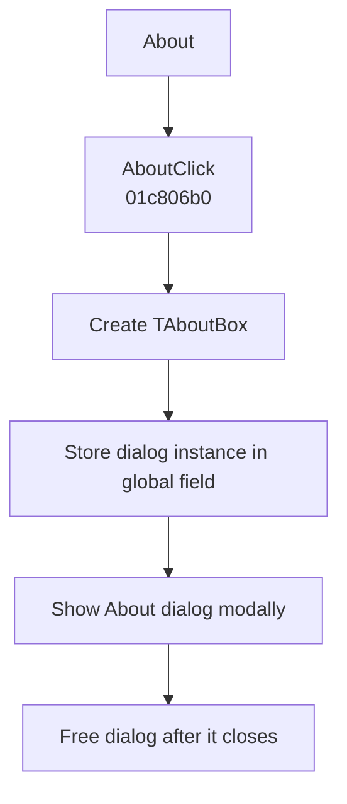

# &About

> Analysis status: Evidence-backed behavior recovered.

## Control

| Property | Recovered value |
| --- | --- |
| Form | SchematicEditor |
| Component path | SchematicEditor.MainMenu.Help.About |
| Control class | TMenuItem |
| Caption | &About |
| Hint | Not present in the recovered resource. |
| Text | Not present in the recovered resource. |
| Handler name | AboutClick |
| Handler address | 01c806b0 |
| Graph node | `resource:dfm:SchematicEditor/SchematicEditor.MainMenu.Help.About` |
| Handler node | `function:01c806b0` |
| Graph layer | UI |

## What happens when clicked

The handler creates the Delphi form at class pointer `PTR_FUN_016FB878`, stores the instance in global `PTR_DAT_02002318`, shows it modally through virtual method `0x2D0`, and frees it. The pointer's published methods match the recovered `TAboutBox` resource. The menu handler has no branch and does not change the schematic model.

## Click flow

## Handler evidence

- Source: [DecompiledSources/Tina16/functions/0000000001C806B0__FUN_01c806b0.c](../../../DecompiledSources/Tina16/functions/0000000001C806B0__FUN_01c806b0.c)
- Recovered role: Opens the modal application About dialog.
- Current graph summary: Handles 1 Delphi UI event: SchematicEditor.MainMenu.Help.About.OnClick.
- Current graph behavior: The handler creates, shows, and frees `TAboutBox`; it makes no schematic edit.
- Current graph evidence: The constructor uses `PTR_FUN_016FB878`. The DFM and published event methods at the same class table identify `TAboutBox`.
- Complexity: moderate
- Distinct outgoing calls: 2

## Direct calls

- `function:00410f20` — Nil-safe Delphi object destruction helper
- `function:007fc180` — FUN_007fc180

## Resource evidence

- Kind: Not present in the recovered resource.
- Modal result: Not present in the recovered resource.
- Checked state: Not present in the recovered resource.
- List items: Not present in the recovered resource.
- Image reference: Not present in the recovered resource.
- Extracted glyph: None.

## Nearby label candidates

Nearby labels are layout candidates only. They are not proof of behavior.

- No same-parent label candidate is available.

## Analysis limits

- Content population is handled by `TAboutBox` lifecycle methods, not by this menu click handler.

