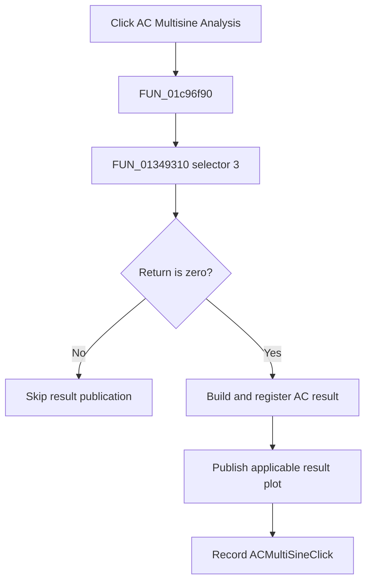

# AC Multisine Analysis...

> Analysis status: Complete. The shared setup, result builder, and plot publisher establish the analysis flow.

## Control

| Property | Recovered value |
| --- | --- |
| Form | SchematicEditor |
| Component path | SchematicEditor.MainMenu.mnAnalysis.ACAnalysis.ACMultiSine |
| Control class | TMenuItem |
| Caption | AC Multisine Analysis... |
| Hint | Not present in the recovered resource. |
| Text | Not present in the recovered resource. |
| Handler name | ACMultiSineClick |
| Handler address | 01c96f90 |
| Graph node | `resource:dfm:SchematicEditor/SchematicEditor.MainMenu.mnAnalysis.ACAnalysis.ACMultiSine` |
| Handler node | `function:01c96f90` |
| Graph layer | UI |

## What happens when clicked

`FUN_01c96f90` calls `FUN_01349310` with selector 3 and the active schematic circuit. This is the same setup routine and selector used by the reviewed Netlist Editor AC Multisine command. Only a zero return continues. The handler then calls `FUN_013d4bc0` to build and register the AC result. If a result manager is present, it also calls `FUN_013c7550` to publish the applicable result plot. Finally, it stores `ACMultiSineClick` as the last command. A nonzero setup return skips result publication and the command-state update.

## Click flow

## Handler evidence

- Source: [DecompiledSources/Tina16/functions/0000000001C96F90__FUN_01c96f90.c](../../../DecompiledSources/Tina16/functions/0000000001C96F90__FUN_01c96f90.c)
- Recovered role: Runs AC Multisine setup and publishes its AC result on a zero return.
- Current graph summary: Handles 1 Delphi UI event: SchematicEditor.MainMenu.mnAnalysis.ACAnalysis.ACMultiSine.OnClick.
- Current graph behavior: Runs shared AC Multisine setup, publishes AC results only on a zero return, and records the command name.
- Current graph evidence: The handler passes selector 3 and the active circuit to `FUN_01349310`, branches on its return, calls AC result builder `FUN_013d4bc0`, optionally calls reviewed plot publisher `FUN_013c7550`, and writes `ACMultiSineClick`. The reviewed Netlist Editor Multisine handler uses the same setup selector and result builder.
- Complexity: complex
- Distinct outgoing calls: 4

## Direct calls

- `function:00414ad0` — Delphi UnicodeString assignment helper
- `function:01349310` — FUN_01349310
- `function:013c7550` — FUN_013c7550
- `function:013d4bc0` — FUN_013d4bc0

## Resource evidence

- Kind: Not present in the recovered resource.
- Modal result: Not present in the recovered resource.
- Checked state: Not present in the recovered resource.
- List items: Not present in the recovered resource.
- Image reference: Not present in the recovered resource.
- Extracted glyph: None.

## Nearby label candidates

Nearby labels are layout candidates only. They are not proof of behavior.

- No same-parent label candidate is available.

## Analysis limits

- The exact meanings of nonzero setup returns and the recovered global output-mode field are not known.

