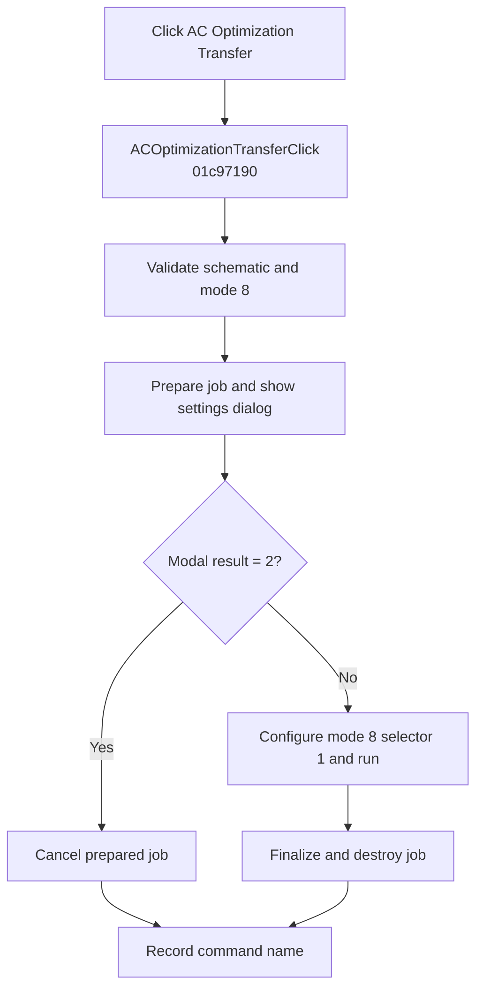

# AC Optimization (&Transfer)...

> Analysis status: Complete. The handler selects AC optimization mode 8 with the transfer selector.

## Control

| Property | Recovered value |
| --- | --- |
| Form | SchematicEditor |
| Component path | SchematicEditor.MainMenu.mnAnalysis.Optimization.ACOptimizationTransfer |
| Control class | TMenuItem |
| Caption | AC Optimization (&Transfer)... |
| Hint | Not present in the recovered resource. |
| Text | Not present in the recovered resource. |
| Handler name | ACOptimizationTransferClick |
| Handler address | 01c97190 |
| Graph node | `resource:dfm:SchematicEditor/SchematicEditor.MainMenu.mnAnalysis.Optimization.ACOptimizationTransfer` |
| Handler node | `function:01c97190` |
| Graph layer | UI |

## What happens when clicked

`FUN_01c97190` calls `FUN_013748b0` with the active schematic, selector `1`, and interactive-dialog flag `0`. The shared routine verifies that the required schematic collections are not empty and that optimization mode `8` is available. It prepares an optimization job and opens its modal settings dialog.

Cancel result `2` cleans the prepared job without running it. An accepted result configures mode `8` with selector `1`, runs and finalizes the job, and destroys it. After the shared routine returns, the handler records `ACOptimizationTransferClick`; this record is also written after Cancel.

## Click flow

## Handler evidence

- Source: [DecompiledSources/Tina16/functions/0000000001C97190__FUN_01c97190.c](../../../DecompiledSources/Tina16/functions/0000000001C97190__FUN_01c97190.c)
- Recovered role: Runs interactive AC optimization with the transfer selector.
- Current graph summary: Handles 1 Delphi UI event: SchematicEditor.MainMenu.mnAnalysis.Optimization.ACOptimizationTransfer.OnClick.
- Current graph behavior: Validates the schematic, opens AC optimization settings, cancels cleanly for modal result 2, or configures and runs mode 8 with selector 1, then records the command.
- Current graph evidence: `FUN_01c97190` differs from the single-output wrapper only by passing selector 1 to `FUN_013748b0`. That callee checks the required collections and capability mode 8, shows the settings dialog, treats result 2 as Cancel, and otherwise runs the mode-8 job.
- Complexity: moderate
- Distinct outgoing calls: 2

## Direct calls

- `function:00414ad0` — Records the command name
- `function:013748b0` — Validates, configures, and runs interactive AC optimization

## Resource evidence

- Kind: Not present in the recovered resource.
- Modal result: Not present in the recovered resource.
- Checked state: Not present in the recovered resource.
- List items: Not present in the recovered resource.
- Image reference: Not present in the recovered resource.
- Extracted glyph: None.

## Nearby label candidates

Nearby labels are layout candidates only. They are not proof of behavior.

- No same-parent label candidate is available.

## Analysis limits

- Localized validation errors are raised inside the shared optimization routine.
- The handler records its command name after both acceptance and cancellation.
- The internal optimizer's convergence and failure codes are not returned to this wrapper.
