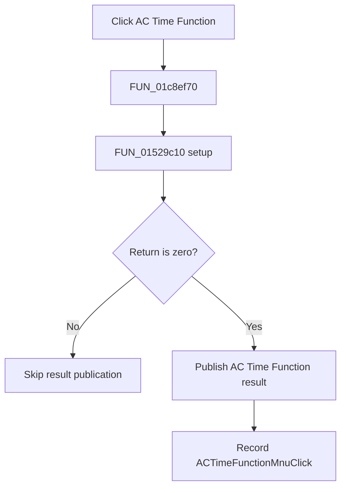

# &Time Function...

> Analysis status: Complete. The shared setup and named AC Time Function publisher establish the flow.

## Control

| Property | Recovered value |
| --- | --- |
| Form | SchematicEditor |
| Component path | SchematicEditor.MainMenu.mnAnalysis.ACAnalysis.ACTimeFunctionMnu |
| Control class | TMenuItem |
| Caption | &Time Function... |
| Hint | Not present in the recovered resource. |
| Text | Not present in the recovered resource. |
| Handler name | ACTimeFunctionMnuClick |
| Handler address | 01c8ef70 |
| Graph node | `resource:dfm:SchematicEditor/SchematicEditor.MainMenu.mnAnalysis.ACAnalysis.ACTimeFunctionMnu` |
| Handler node | `function:01c8ef70` |
| Graph layer | UI |

## What happens when clicked

`FUN_01c8ef70` calls the shared AC Time Function setup routine `FUN_01529c10`. Only a zero return continues to `FUN_013d87d0`. That routine creates an `AC Time Function result` container, registers `Analysis Result 1`, publishes it, and refreshes the result UI. The handler then stores `ACTimeFunctionMnuClick` as the last command. A nonzero setup return skips publication and the command-state update.

## Click flow

## Handler evidence

- Source: [DecompiledSources/Tina16/functions/0000000001C8EF70__FUN_01c8ef70.c](../../../DecompiledSources/Tina16/functions/0000000001C8EF70__FUN_01c8ef70.c)
- Recovered role: Runs AC Time Function setup and publishes the result on a zero return.
- Current graph summary: Handles 1 Delphi UI event: SchematicEditor.MainMenu.mnAnalysis.ACAnalysis.ACTimeFunctionMnu.OnClick.
- Current graph behavior: Runs shared AC Time Function setup, publishes a named result only on a zero return, and records the command name.
- Current graph evidence: The handler branches on `FUN_01529c10`, calls `FUN_013d87d0` only on zero, and writes `ACTimeFunctionMnuClick`. `FUN_013d87d0` contains `AC Time Function result` and `Analysis Result 1`. The reviewed Netlist Editor command uses the same setup and publisher pair.
- Complexity: complex
- Distinct outgoing calls: 3

## Direct calls

- `function:00414ad0` — Delphi UnicodeString assignment helper
- `function:013d87d0` — FUN_013d87d0
- `function:01529c10` — FUN_01529c10

## Resource evidence

- Kind: Not present in the recovered resource.
- Modal result: Not present in the recovered resource.
- Checked state: Not present in the recovered resource.
- List items: Not present in the recovered resource.
- Image reference: Not present in the recovered resource.
- Extracted glyph: None.

## Nearby label candidates

Nearby labels are layout candidates only. They are not proof of behavior.

- No same-parent label candidate is available.

## Analysis limits

- The exact meanings of nonzero setup returns are not recovered.

