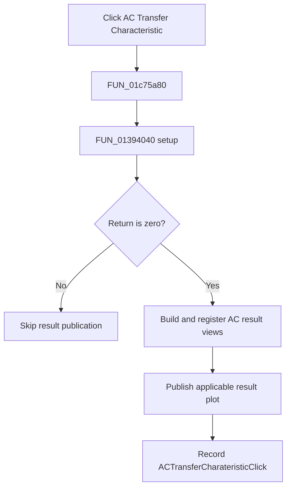

# &AC Transfer Characteristic...

> Analysis status: Complete. The shared AC transfer setup and result publishers establish the flow.

## Control

| Property | Recovered value |
| --- | --- |
| Form | SchematicEditor |
| Component path | SchematicEditor.MainMenu.mnAnalysis.ACAnalysis.ACTransferCharateristic |
| Control class | TMenuItem |
| Caption | &AC Transfer Characteristic... |
| Hint | Not present in the recovered resource. |
| Text | Not present in the recovered resource. |
| Handler name | ACTransferCharateristicClick |
| Handler address | 01c75a80 |
| Graph node | `resource:dfm:SchematicEditor/SchematicEditor.MainMenu.mnAnalysis.ACAnalysis.ACTransferCharateristic` |
| Handler node | `function:01c75a80` |
| Graph layer | UI |

## What happens when clicked

`FUN_01c75a80` calls `FUN_01394040` with the active schematic circuit. This is the same setup routine used by the reviewed Netlist Editor AC Transfer Characteristic command. Only a zero return continues. The handler calls `FUN_013d4bc0` to build and register AC result views, optionally calls `FUN_013c7550` to publish the applicable plot when a result manager exists, and stores `ACTransferCharateristicClick` as the last command. A nonzero return skips these steps.

## Click flow

## Handler evidence

- Source: [DecompiledSources/Tina16/functions/0000000001C75A80__FUN_01c75a80.c](../../../DecompiledSources/Tina16/functions/0000000001C75A80__FUN_01c75a80.c)
- Recovered role: Runs AC Transfer Characteristic setup and publishes its AC result on a zero return.
- Current graph summary: Handles 1 Delphi UI event: SchematicEditor.MainMenu.mnAnalysis.ACAnalysis.ACTransferCharateristic.OnClick.
- Current graph behavior: Runs shared AC transfer setup, publishes AC results only on a zero return, and records the command name.
- Current graph evidence: The handler branches on `FUN_01394040`, calls `FUN_013d4bc0`, optionally calls reviewed publisher `FUN_013c7550`, and writes `ACTransferCharateristicClick`. The reviewed Netlist Editor transfer command uses the same setup and result builder.
- Complexity: complex
- Distinct outgoing calls: 4

## Direct calls

- `function:00414ad0` — Delphi UnicodeString assignment helper
- `function:01394040` — FUN_01394040
- `function:013c7550` — FUN_013c7550
- `function:013d4bc0` — FUN_013d4bc0

## Resource evidence

- Kind: Not present in the recovered resource.
- Modal result: Not present in the recovered resource.
- Checked state: Not present in the recovered resource.
- List items: Not present in the recovered resource.
- Image reference: Not present in the recovered resource.
- Extracted glyph: None.

## Nearby label candidates

Nearby labels are layout candidates only. They are not proof of behavior.

- No same-parent label candidate is available.

## Analysis limits

- The exact meanings of nonzero setup returns and the recovered global output-mode field are not known.

