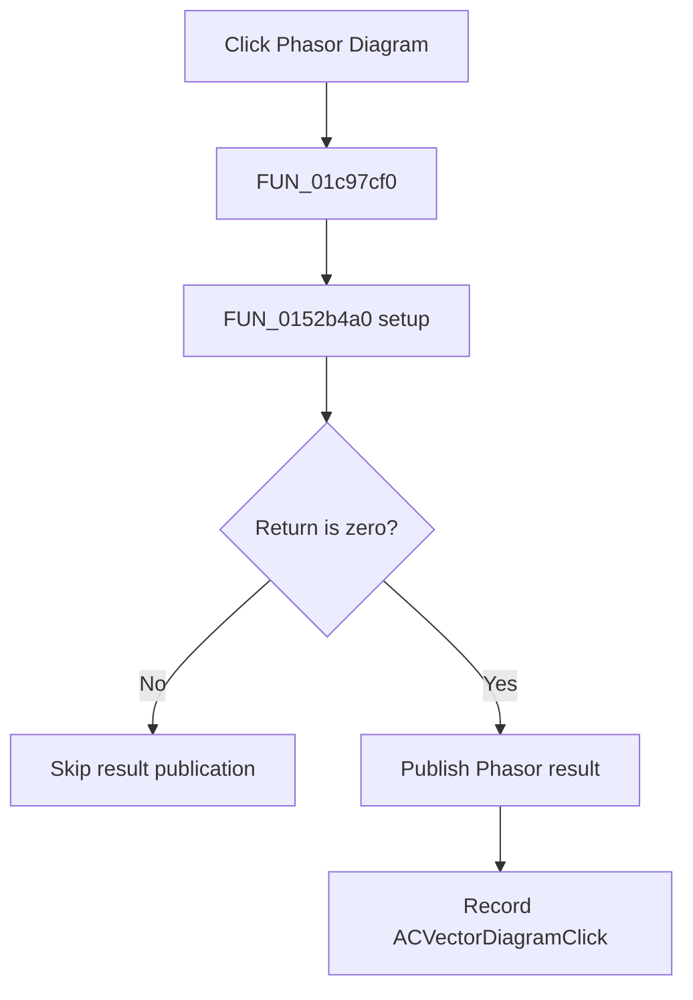

# &Phasor Diagram

> Analysis status: Complete. The shared setup and named phasor publisher establish the flow.

## Control

| Property | Recovered value |
| --- | --- |
| Form | SchematicEditor |
| Component path | SchematicEditor.MainMenu.mnAnalysis.ACAnalysis.ACVectorDiagram |
| Control class | TMenuItem |
| Caption | &Phasor Diagram |
| Hint | Not present in the recovered resource. |
| Text | Not present in the recovered resource. |
| Handler name | ACVectorDiagramClick |
| Handler address | 01c97cf0 |
| Graph node | `resource:dfm:SchematicEditor/SchematicEditor.MainMenu.mnAnalysis.ACAnalysis.ACVectorDiagram` |
| Handler node | `function:01c97cf0` |
| Graph layer | UI |

## What happens when clicked

`FUN_01c97cf0` calls the shared phasor setup routine `FUN_0152b4a0`. Only a zero return continues to `FUN_013e0570`. That routine builds and publishes a result identified by the recovered strings `Phasor` and `Analysis Result 1`. The handler then stores `ACVectorDiagramClick` as the last command. A nonzero setup return skips publication and the command-state update.

## Click flow

## Handler evidence

- Source: [DecompiledSources/Tina16/functions/0000000001C97CF0__FUN_01c97cf0.c](../../../DecompiledSources/Tina16/functions/0000000001C97CF0__FUN_01c97cf0.c)
- Recovered role: Runs phasor setup and publishes the result on a zero return.
- Current graph summary: Handles 1 Delphi UI event: SchematicEditor.MainMenu.mnAnalysis.ACAnalysis.ACVectorDiagram.OnClick.
- Current graph behavior: Runs shared phasor setup, publishes a named Phasor result only on a zero return, and records the command name.
- Current graph evidence: The handler branches on `FUN_0152b4a0`, calls `FUN_013e0570` only on zero, and writes `ACVectorDiagramClick`. `FUN_013e0570` contains `Phasor` and `Analysis Result 1`. The reviewed Netlist Editor command uses the same setup and publisher pair.
- Complexity: complex
- Distinct outgoing calls: 3

## Direct calls

- `function:00414ad0` — Delphi UnicodeString assignment helper
- `function:013e0570` — FUN_013e0570
- `function:0152b4a0` — FUN_0152b4a0

## Resource evidence

- Kind: Not present in the recovered resource.
- Modal result: Not present in the recovered resource.
- Checked state: Not present in the recovered resource.
- List items: Not present in the recovered resource.
- Image reference: Not present in the recovered resource.
- Extracted glyph: None.

## Nearby label candidates

Nearby labels are layout candidates only. They are not proof of behavior.

- No same-parent label candidate is available.

## Analysis limits

- The exact meanings of nonzero setup returns are not recovered.

