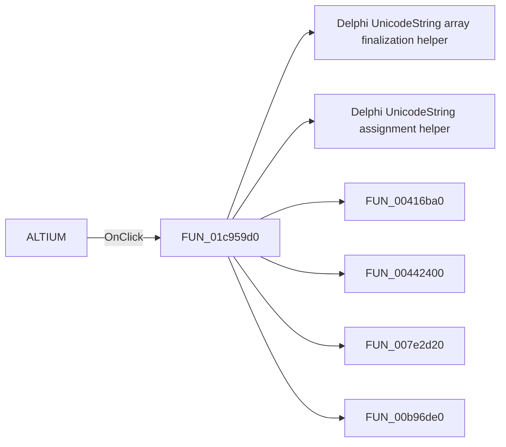

# ALTIUM

> Analysis status: Pending individual source review.

## Control

| Property | Recovered value |
| --- | --- |
| Form | SchematicEditor |
| Component path | SchematicEditor.MainMenu.mnFile.pcbdirectory1.AltiumPCBProject1 |
| Control class | TMenuItem |
| Caption | ALTIUM |
| Hint | Not present in the recovered resource. |
| Text | Not present in the recovered resource. |
| Handler name | AltiumPCBProject1Click |
| Handler address | 01c959d0 |
| Graph node | `resource:dfm:SchematicEditor/SchematicEditor.MainMenu.mnFile.pcbdirectory1.AltiumPCBProject1` |
| Handler node | `function:01c959d0` |
| Graph layer | UI |

## What happens when clicked

Pending individual analysis. An agent must read the recovered handler source and its relevant callees before it replaces this text.

## Click flow

## Handler evidence

- Source: [DecompiledSources/Tina16/functions/0000000001C959D0__FUN_01c959d0.c](../../../DecompiledSources/Tina16/functions/0000000001C959D0__FUN_01c959d0.c)
- Recovered role: Not present in the recovered resource.
- Current graph summary: Handles 1 Delphi UI event: SchematicEditor.MainMenu.mnFile.pcbdirectory1.AltiumPCBProject1.OnClick.
- Current graph behavior: Not present in the recovered resource.
- Current graph evidence: Not present in the recovered resource.
- Complexity: complex
- Distinct outgoing calls: 10

## Direct calls

- `function:00414560` — Delphi UnicodeString array finalization helper
- `function:00414ad0` — Delphi UnicodeString assignment helper
- `function:00416ba0` — FUN_00416ba0
- `function:00442400` — FUN_00442400
- `function:007e2d20` — FUN_007e2d20
- `function:00b96de0` — FUN_00b96de0
- `function:00eadc90` — FUN_00eadc90
- `function:00eae050` — FUN_00eae050
- `function:00ec0300` — FUN_00ec0300
- `function:00ecbc20` — FUN_00ecbc20

## Resource evidence

- Kind: Not present in the recovered resource.
- Modal result: Not present in the recovered resource.
- Checked state: Not present in the recovered resource.
- List items: Not present in the recovered resource.
- Image reference: Not present in the recovered resource.
- Extracted glyph: None.

## Nearby label candidates

Nearby labels are layout candidates only. They are not proof of behavior.

- No same-parent label candidate is available.

## Analysis limits

- Do not infer behavior from the control class, caption, hint, glyph, or nearby label alone.
- Do not replace the pending status until the handler source and relevant call path provide enough evidence.
