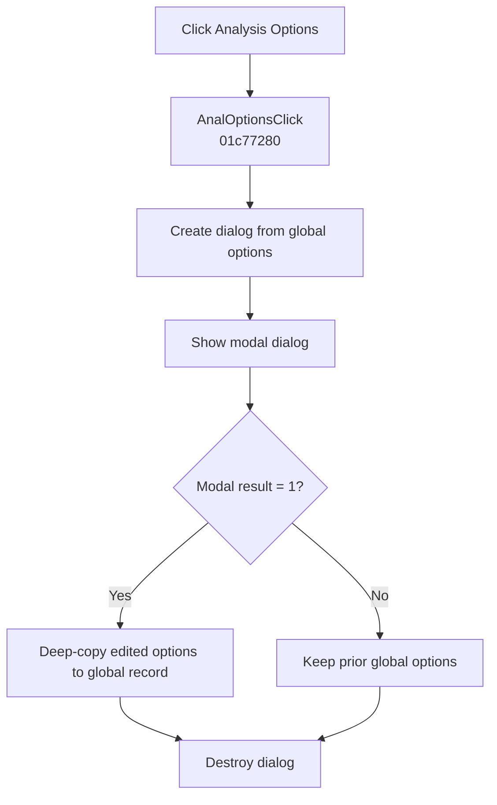

# &Options...

> Analysis status: Complete. The modal result controls whether the edited analysis options replace the global options record.

## Control

| Property | Recovered value |
| --- | --- |
| Form | SchematicEditor |
| Component path | SchematicEditor.MainMenu.mnAnalysis.AnalOptions |
| Control class | TMenuItem |
| Caption | &Options... |
| Hint | Not present in the recovered resource. |
| Text | Not present in the recovered resource. |
| Handler name | AnalOptionsClick |
| Handler address | 01c77280 |
| Graph node | `resource:dfm:SchematicEditor/SchematicEditor.MainMenu.mnAnalysis.AnalOptions` |
| Handler node | `function:01c77280` |
| Graph layer | UI |

## What happens when clicked

`FUN_01c77280` creates an analysis-options dialog from the current global options record and shows it modally. If the modal result is `1`, the handler deep-copies the dialog's edited record back to the global record. Any other result keeps the prior options.

The handler destroys the dialog on both branches. It has no local exception handler.

## Click flow

## Handler evidence

- Source: [DecompiledSources/Tina16/functions/0000000001C77280__FUN_01c77280.c](../../../DecompiledSources/Tina16/functions/0000000001C77280__FUN_01c77280.c)
- Recovered role: Opens Analysis Options and commits the edited record only for modal result 1.
- Current graph summary: Handles 1 Delphi UI event: SchematicEditor.MainMenu.mnAnalysis.AnalOptions.OnClick.
- Current graph behavior: Creates the options dialog from the global record, shows it modally, copies accepted edits back for result 1, and always destroys the dialog.
- Current graph evidence: `FUN_01c77280` calls `FUN_014f15b0` with the global options record, dispatches the modal method at VMT offset `+0x2d0`, calls the record-copy helper only when the result is 1, and then calls the nil-safe destructor. `NetlistEditor.MIOptionClick` has the same recovered body.
- Complexity: complex
- Distinct outgoing calls: 3

## Direct calls

- `function:00410f20` — Destroys the dialog when it is not nil
- `function:00417c40` — Deep-copies the accepted Delphi record
- `function:014f15b0` — Constructs the options dialog from the supplied options record

## Resource evidence

- Kind: Not present in the recovered resource.
- Modal result: Not present in the recovered resource.
- Checked state: Not present in the recovered resource.
- List items: Not present in the recovered resource.
- Image reference: Not present in the recovered resource.
- Extracted glyph: None.

## Nearby label candidates

Nearby labels are layout candidates only. They are not proof of behavior.

- No same-parent label candidate is available.

## Analysis limits

- The recovered class name of the options dialog is not available.
- The wrapper does not validate individual option values; that work stays inside the dialog.
