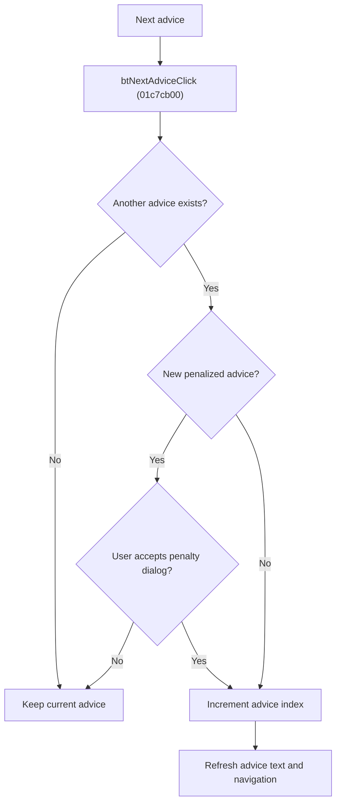

# &Next

> Analysis status: Reviewed from recovered source, call paths, and glyph evidence.

## Control

| Property | Recovered value |
| --- | --- |
| Component path | SchematicEditor.EditorPanel.ExamPanel.ExamMainPages.tsAdvisor.GroupBox3.btNextAdvice |
| Control class | TBitBtn |
| Handler | btNextAdviceClick at 01c7cb00 |

## What happens when clicked

The handler moves to the next exam advice only when another advice exists. For newly reached advice with a positive penalty, it calculates the remaining score from the accumulated advice penalties and shows a localized confirmation dialog. A result other than `1` cancels the move. An accepted move increments the current advice index and refreshes the advice text and Previous/Next enabled states.

## Click flow

## Handler evidence

- Source: [FUN_01c7cb00](../../../DecompiledSources/Tina16/functions/0000000001C7CB00__FUN_01c7cb00.c)
- The handler compares index offset `0x17f8` with the current advice-list count and tracks the furthest viewed index at `0x17fc`.
- `FUN_012bec10` totals advice penalties. The handler uses the next record's penalty field at offset `0x08` in its confirmation path.
- [FUN_01c7c9a0](../../../DecompiledSources/Tina16/functions/0000000001C7C9A0__FUN_01c7c9a0.c) loads the selected advice text and updates both navigation controls.
- Extracted glyph: [Next glyph](../../../glyph/0365_SchematicEditor_SchematicEditor_EditorPanel_ExamPanel_ExamMainPages_tsAdvisor_GroupBox3_btNextAdvice_Glyph_Data.png)

## No-op and error behavior

- No next record: no state change.
- Rejected penalty dialog: no state change.
- The recovered path has no separate exception or error branch.
