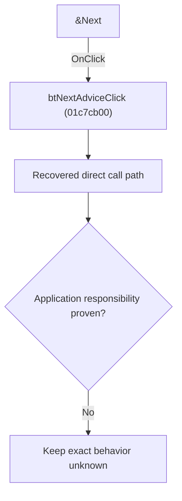

# &Next

> Analysis status: Blocked by an exact evidence gap.

## Control

| Property | Recovered value |
| --- | --- |
| Form | SchematicEditor |
| Component path | SchematicEditor.EditorPanel.ExamPanel.ExamMainPages.tsAdvisor.GroupBox3.btNextAdvice |
| Control class | TBitBtn |
| Caption | &Next |
| Hint | Not present in the recovered resource. |
| Text | Not present in the recovered resource. |
| Handler name | btNextAdviceClick |
| Handler address | 01c7cb00 |
| Graph node | `resource:dfm:SchematicEditor/SchematicEditor.EditorPanel.ExamPanel.ExamMainPages.tsAdvisor.GroupBox3.btNextAdvice` |
| Handler node | `function:01c7cb00` |
| Graph layer | UI |

## What happens when clicked

The OnClick binding reaches btNextAdviceClick at 01c7cb00. The recovered body has 9 distinct outgoing graph call(s), but the application-specific responsibilities and data effects of its downstream path are not established in the accepted graph evidence. The control's caption or name indicates user intent only; it is not enough to claim implementation behavior.

## Click flow

## Handler evidence

- Source: [DecompiledSources/Tina16/functions/0000000001C7CB00__FUN_01c7cb00.c](../../../DecompiledSources/Tina16/functions/0000000001C7CB00__FUN_01c7cb00.c)
- Recovered role: Evidence-blocked btNextAdviceClick command.
- Current graph summary: Handles 1 Delphi UI event: SchematicEditor.EditorPanel.ExamPanel.ExamMainPages.tsAdvisor.GroupBox3.btNextAdvice.OnClick.
- Current graph behavior: The OnClick binding reaches btNextAdviceClick at 01c7cb00. The recovered body has 9 distinct outgoing graph call(s), but the application-specific responsibilities and data effects of its downstream path are not established in the accepted graph evidence. The control's caption or name indicates user intent only; it is not enough to claim implementation behavior.
- Current graph evidence: The DFM binds SchematicEditor.EditorPanel.ExamPanel.ExamMainPages.tsAdvisor.GroupBox3.btNextAdvice to btNextAdviceClick. The recovered source is DecompiledSources/Tina16/functions/0000000001C7CB00__FUN_01c7cb00.c and directly references 00414480, 004aeac0, 0072d440, 00b89270, 00b8e520, 00b91700, 012bec10, 01c7c9a0, and 1 more. No accepted end-to-end role was established for this control path.
- Complexity: complex
- Distinct outgoing calls: 9

## Direct calls

- `function:00414480` — Delphi UnicodeString clear and finalization helper
- `function:004aeac0` — FUN_004aeac0
- `function:0072d440` — FUN_0072d440
- `function:00b89270` — FUN_00b89270
- `function:00b8e520` — FUN_00b8e520
- `function:00b91700` — FUN_00b91700
- `function:012bec10` — FUN_012bec10
- `function:01c7c9a0` — FUN_01c7c9a0
- `function:01c7d9d0` — FUN_01c7d9d0

## Resource evidence

- Kind: Not present in the recovered resource.
- Modal result: Not present in the recovered resource.
- Checked state: Not present in the recovered resource.
- List items: Not present in the recovered resource.
- Image reference: Not present in the recovered resource.
- Extracted glyph: [`0365_SchematicEditor_SchematicEditor_EditorPanel_ExamPanel_ExamMainPages_tsAdvisor_GroupBox3_btNextAdvice_Glyph_Data.png`](../../../glyph/0365_SchematicEditor_SchematicEditor_EditorPanel_ExamPanel_ExamMainPages_tsAdvisor_GroupBox3_btNextAdvice_Glyph_Data.png)

## Nearby label candidates

Nearby labels are layout candidates only. They are not proof of behavior.

- No same-parent label candidate is available.

## Analysis limits

- Exact gap: the recovered handler or one of its direct application callees lacks a source-supported role that proves the command's decisions, state changes, and output. Keep this Bead open until those callees are traced.

