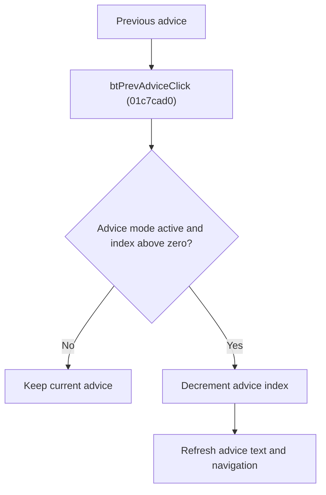

# &Previous

> Analysis status: Reviewed from recovered source, call paths, and glyph evidence.

## Control

| Property | Recovered value |
| --- | --- |
| Component path | SchematicEditor.EditorPanel.ExamPanel.ExamMainPages.tsAdvisor.GroupBox3.btPrevAdvice |
| Control class | TBitBtn |
| Handler | btPrevAdviceClick at 01c7cad0 |

## What happens when clicked

The handler moves to the previous exam advice only when advice display mode is active and the current advice index is greater than zero. It decrements the index and refreshes the displayed advice text and the Previous/Next enabled states. It does not change the penalty total.

## Click flow

## Handler evidence

- Source: [FUN_01c7cad0](../../../DecompiledSources/Tina16/functions/0000000001C7CAD0__FUN_01c7cad0.c)
- The handler tests mode byte `0x1800` and index `0x17f8` before it decrements the index.
- [FUN_01c7c9a0](../../../DecompiledSources/Tina16/functions/0000000001C7C9A0__FUN_01c7c9a0.c) loads advice text and updates navigation state.
- Extracted glyph: [Previous glyph](../../../glyph/0364_SchematicEditor_SchematicEditor_EditorPanel_ExamPanel_ExamMainPages_tsAdvisor_GroupBox3_btPrevAdvice_Glyph_Data.png)

## No-op and error behavior

- Inactive advice mode or the first advice: no state change.
- The recovered path has no dialog or separate error branch.
