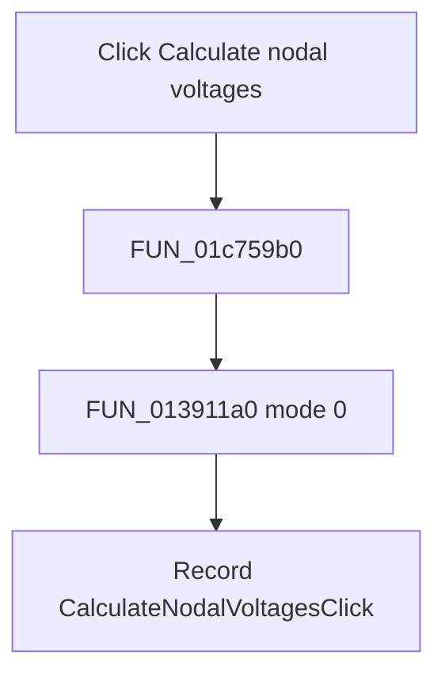

# &Calculate nodal voltages

> Analysis status: Complete. The shared solver mode and command-state write establish the action.

## Control

| Property | Recovered value |
| --- | --- |
| Form | SchematicEditor |
| Component path | SchematicEditor.MainMenu.mnAnalysis.ACAnalysis.CalculateNodalVoltages |
| Control class | TMenuItem |
| Caption | &Calculate nodal voltages |
| Hint | Not present in the recovered resource. |
| Text | Not present in the recovered resource. |
| Handler name | CalculateNodalVoltagesClick |
| Handler address | 01c759b0 |
| Graph node | `resource:dfm:SchematicEditor/SchematicEditor.MainMenu.mnAnalysis.ACAnalysis.CalculateNodalVoltages` |
| Handler node | `function:01c759b0` |
| Graph layer | UI |

## What happens when clicked

`FUN_01c759b0` calls the central circuit-analysis routine `FUN_013911a0` with the active schematic circuit and mode 0. The reviewed Netlist Editor `Calculate nodal voltages` command calls the same routine with mode 0. After the call, this handler stores `CalculateNodalVoltagesClick` as the last command. It does not test the solver return and does not call the result-form wrapper directly.

## Click flow

## Handler evidence

- Source: [DecompiledSources/Tina16/functions/0000000001C759B0__FUN_01c759b0.c](../../../DecompiledSources/Tina16/functions/0000000001C759B0__FUN_01c759b0.c)
- Recovered role: Runs the central nodal-voltage calculation in mode 0 and records the command.
- Current graph summary: Handles 1 Delphi UI event: SchematicEditor.MainMenu.mnAnalysis.ACAnalysis.CalculateNodalVoltages.OnClick.
- Current graph behavior: Invokes the central analysis routine in nodal-voltage mode and stores the recovered command name.
- Current graph evidence: The handler passes mode 0 and the active circuit to `FUN_013911a0`, then assigns `CalculateNodalVoltagesClick` to form field `0x27E8`. The reviewed Netlist Editor nodal-voltage handler uses the same solver routine and mode.
- Complexity: moderate
- Distinct outgoing calls: 2

## Direct calls

- `function:00414ad0` — Delphi UnicodeString assignment helper
- `function:013911a0` — FUN_013911a0

## Resource evidence

- Kind: Not present in the recovered resource.
- Modal result: Not present in the recovered resource.
- Checked state: Not present in the recovered resource.
- List items: Not present in the recovered resource.
- Image reference: Not present in the recovered resource.
- Extracted glyph: None.

## Nearby label candidates

Nearby labels are layout candidates only. They are not proof of behavior.

- No same-parent label candidate is available.

## Analysis limits

- This wrapper ignores the solver return. The exact error reporting and result presentation occur inside the central analysis path or its consumers.

